# Configurer les switches Aruba CX pour Central NAC — EAP-TLS avec Microsoft Intune

[](.)
[](.)
[](.)
[](.)
[](.)

## Table des matières

- [Vue d'ensemble](#vue-densemble)
- [Prérequis](#prérequis)
- [Architecture](#architecture)
- [Partie 1 — Configuration Central NAC (delta filaire)](#partie-1--configuration-central-nac-delta-filaire)
  - [1.1 Profil d'authentification EAP-TLS filaire](#11-profil-dauthentification-eap-tls-filaire)
  - [1.2 Politique d'autorisation filaire](#12-politique-dautorisation-filaire)
  - [1.3 Rôles filaire — Local User Roles (contrainte CX 6000/6100)](#13-rôles-filaire--local-user-roles-contrainte-cx-60006100)
- [Partie 2 — Configuration du switch CX dans Central](#partie-2--configuration-du-switch-cx-dans-central)
  - [2.1 Serveur d'authentification sys_central_nac](#21-serveur-dauthentification-sys_central_nac)
  - [2.2 Profil AAA](#22-profil-aaa)
  - [2.3 Port Profile](#23-port-profile)
  - [2.4 Application du Port Profile sur les interfaces](#24-application-du-port-profile-sur-les-interfaces)
- [Partie 2bis — Configuration du supplicant 802.1X sur Windows](#partie-2bis--configuration-du-supplicant-8021x-sur-windows)
- [Partie 3 — Validation](#partie-3--validation)
  - [3.1 Central NAC — vue Clients](#31-central-nac--vue-clients)
  - [3.2 Validation CLI sur le switch CX](#32-validation-cli-sur-le-switch-cx)
- [Problèmes fréquents](#problèmes-fréquents)
- [Références](#références)

---

## Vue d'ensemble

Ce guide étend la configuration EAP-TLS + Intune Wi-Fi au **802.1X filaire sur les switches Aruba CX** gérés dans Aruba Central.

> **Partie 0 — Configuration Wi-Fi de base (prérequis)**
> Complétez d'abord le guide Wi-Fi :
> [central-nac-intune](../central-nac-intune/README.md) — Central NAC EAP-TLS avec Microsoft Intune (Wi-Fi)
>
> L'extension Intune, l'Identity Store OAuth, l'URL SCEP et le certificat CA racine sont **réutilisés tels quels**. Ce guide couvre uniquement les deltas filaires dans Central NAC et les profils du switch CX.

> **Configuration switch de base (prérequis)**
> Ce guide s'appuie sur [willembargeman/hpe-networking-guides — central-nac-cx-switch](https://github.com/willembargeman/hpe-networking-guides/blob/main/central-nac-cx-switch/README.md) pour la MAC auth.

Dans ce lab, un **Aruba CX 6000 sous AOS-CX 10.17** est utilisé.
Les mêmes étapes s'appliquent à toutes les plateformes CX supportant le 802.1X (CX 6100, 6300, 6400, 8xxx).

---

## Prérequis

- Switch Aruba CX géré dans **Aruba Central** (AOS-CX 10.16 ou supérieur recommandé)
- Guide Wi-Fi EAP-TLS terminé : extension Intune active, Identity Store OAuth validé, SCEP actif
- **Port TCP 2083** ouvert entre le switch et Central NAC (RadSec)
- Profil SCEP et profil Trusted Certificate Intune déployés sur les endpoints (voir [microsoft-intune / eap-tls](https://github.com/Luconik/microsoft-intune/tree/main/eap-tls))
- Les endpoints doivent recevoir le certificat client **avant** de se connecter au port filaire

---

## Architecture

```
Endpoint (géré par Intune — Windows / macOS)
    │
    │  Certificat SCEP émis par la CA Central NAC
    │  (déployé via Intune — même certificat que le Wi-Fi)
    ▼
Aruba CX 6000 (802.1X EAP-TLS, port-access)
    │
    │  RadSec TLS / TCP-2083
    ▼
Aruba Central NAC
    │
    │  Vérification conformité via OAuth2
    ▼
Microsoft Intune / Entra ID
    │
    ▼
Accès réseau accordé
Rôle attribué → VLAN appliqué sur l'interface CX
(CoA : Central NAC envoie un RADIUS CoA pour mettre à jour le rôle/VLAN sans re-authentification)
```

---

## Partie 1 — Configuration Central NAC (delta filaire)

> L'extension Intune et l'Identity Store OAuth du guide Wi-Fi sont **inchangés**.
> Seuls les trois objets suivants nécessitent une mise à jour pour le filaire.

### 1.1 Profil d'authentification EAP-TLS filaire

Naviguer vers :

```
Central NAC → Configuration → Authentication Profiles → [votre profil EAP-TLS] → Edit
```

Activer le support filaire sur le profil EAP-TLS existant.

| Paramètre | Valeur |
|---|---|
| **Authentication Type** | EAP-TLS |
| **Identity Store** | *votre store OAuth Intune* |
| **Use for wired connection** | ✓ |
| **Use for wireless connection** | ✓ (conserver si partagé avec le Wi-Fi) |

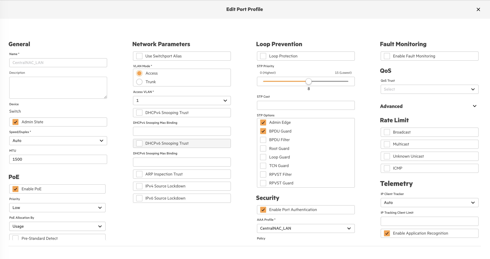

---

### 1.2 Politique d'autorisation filaire

Naviguer vers :

```
Central NAC → Configuration → Authorization Policies → [votre politique] → Edit
```

La politique `Luconik_Authorization_Policies` (type **User**, Identity Store `Luconik_EntraID`) est utilisée pour le filaire et le Wi-Fi.

| Règle | Condition | Rôle retourné (VSA Aruba-User-Role) |
|---|---|---|
| Corp compliant | Intune compliant = true | `employee-role` |
| Marketing | Groupe EntraID = Marketing | `marketing-role` |
| Retail | Groupe EntraID = Retail | `retail-role` |
| Design | Groupe EntraID = Design | `design-role` |
| Sales | Groupe EntraID = Sales | `sales-role` |
| IT Admin | Groupe EntraID = IT Admins | `admin-role` |
| Deny All | — | Deny |

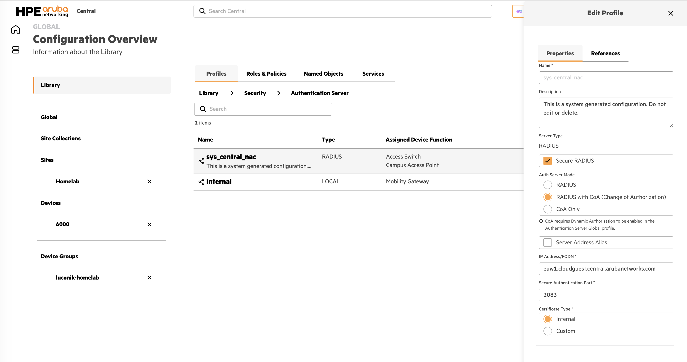

> **Comportement CoA** — En cas de changement de conformité Intune, Central NAC envoie un RADIUS Change of Authorization au switch. Le switch met à jour le rôle/VLAN de la session sans re-authentification complète.

---

### 1.3 Rôles filaire — Local User Roles (contrainte CX 6000/6100)

> **Contrainte CX 6000/6100**
> Les DUR (Downloadable User Role) ne sont **pas supportés** sur les CX 6000 et 6100 (limitation ASIC, toutes versions AOS-CX).
> L'option **Always Download Role** dans Central NAC n'a aucun effet sur ces plateformes.
>
> **Solution : Local User Roles (LUR)**
> Les rôles doivent être pré-configurés localement sur le switch. Central NAC retourne le nom du rôle via la VSA RADIUS `Aruba-User-Role`. Le switch applique le LUR correspondant qui contient l'affectation VLAN.
>
> Les DUR / Always Download Role fonctionnent sur CX 6200, 6300, 6400, 8xxx.

Les rôles LUR sont configurés localement sur le switch (générés par Central via les rôles Library) :

```
port-access role employee-role
    auth-mode client-mode
    vlan access 11
    stp-admin-edge-port
!
port-access role marketing-role
    auth-mode client-mode
    vlan access 12
    stp-admin-edge-port
!
port-access role retail-role
    auth-mode client-mode
    vlan access 13
    stp-admin-edge-port
!
port-access role design-role
    auth-mode client-mode
    vlan access 14
    stp-admin-edge-port
!
port-access role sales-role
    auth-mode client-mode
    vlan access 15
    stp-admin-edge-port
!
port-access role admin-role
    auth-mode client-mode
    vlan access 90
    stp-admin-edge-port
!
```

| Nom du rôle (LUR switch) | VLAN | Nom VLAN |
|---|---|---|
| `employee-role` | 11 | Corporate |
| `marketing-role` | 12 | Marketing |
| `retail-role` | 13 | Retail |
| `design-role` | 14 | Design |
| `sales-role` | 15 | Sales |
| `admin-role` | 90 | admin |

> Les noms de rôles sont **sensibles à la casse** et doivent correspondre exactement entre le LUR sur le switch et la valeur `Aruba-User-Role` retournée par Central NAC.

---

## Partie 2 — Configuration du switch CX dans Central

### 2.1 Serveur d'authentification sys_central_nac

Le serveur `sys_central_nac` est généré automatiquement par Central NAC lors de l'enregistrement du switch.

Naviguer vers :

```
Aruba Central → Configuration → Library → Security → Authentication Server → sys_central_nac
```

| Paramètre | Valeur |
|---|---|
| **Server Type** | RADIUS |
| **Secure RADIUS** | ✓ |
| **Auth Server Mode** | RADIUS with CoA (Change of Authorization) |
| **IP Address/FQDN** | `euw1.cloudguest.central.arubanetworks.com` |
| **Secure Authentication Port** | 2083 |
| **Certificate Type** | Internal |


Configuration poussée sur le switch :

```
radius-server host euw1.cloudguest.central.arubanetworks.com tls timeout 20 port-access keep-alive
!
aaa group server radius sys_central_nac
    server euw1.cloudguest.central.arubanetworks.com tls
!
aaa radius-attribute group sys_central_nac
    nas-id value <UUID-SWITCH>
    nas-id request-type both
!
aaa accounting port-access start-stop interim 5 group sys_central_nac
!
radius dyn-authorization enable
radius dyn-authorization client euw1.cloudguest.central.arubanetworks.com tls
!
aaa authentication port-access dot1x authenticator
    radius server-group sys_central_nac
    enable
!
```

> **FQDN** — `euw1` pour l'Europe West 1. Vérifier dans Central NAC → Configuration → RADIUS Server selon votre région.

---

### 2.2 Profil AAA

Naviguer vers :

```
Aruba Central → [switch] → Profiles → Security → AAA Authentication → CentralNAC_LAN
```

| Paramètre | Valeur |
|---|---|
| **Authentication Protocol** | 802.1X |
| **802.1X Authentication Server Group** | Central NAC (`sys_central_nac`) |
| **RADIUS Override** | ✓ |

---

### 2.3 Port Profile

Naviguer vers :

```
Aruba Central → [switch] → Profiles → Interfaces → Port Profiles → CentralNAC_LAN
```

| Paramètre | Valeur |
|---|---|
| **Device** | Switch |
| **VLAN Mode** | Access |
| **Access VLAN** | 1 (VLAN pré-auth) |
| **Admin Edge** | ✓ |
| **BPDU Guard** | ✓ |
| **Enable Port Authentication** | ✓ |
| **AAA Profile** | `CentralNAC_LAN` |

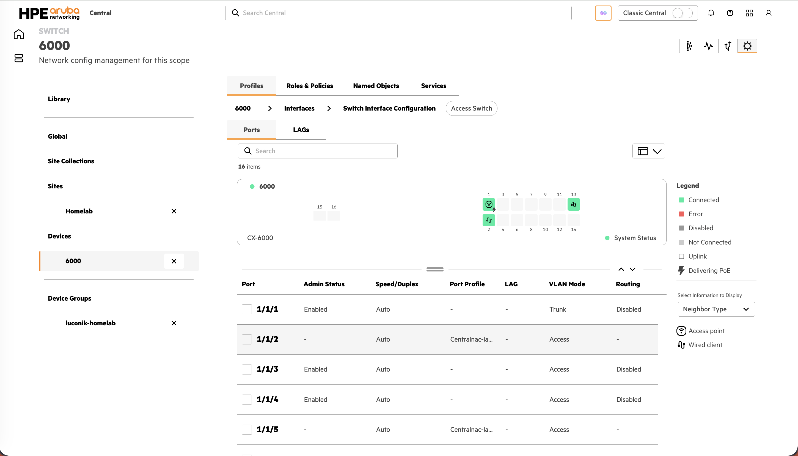

Configuration poussée sur le switch :

```
interface 1/1/2
    no shutdown
    vlan access 1
    spanning-tree bpdu-guard
    spanning-tree port-type admin-edge
    no aaa authentication port-access allow-lldp-auth
    no aaa authentication port-access allow-cdp-auth
    aaa authentication port-access radius-override enable
    aaa authentication port-access dot1x authenticator
        radius server-group sys_central_nac
        enable
    exit
```

---

### 2.4 Application du Port Profile sur les interfaces

Naviguer vers :

```
Aruba Central → [switch] → Interfaces → Switch Interface Configuration → [interface] → Edit
```

| Paramètre | Valeur |
|---|---|
| **Use Port Profile** | ✓ |
| **Port Profile** | `CentralNAC_LAN` |

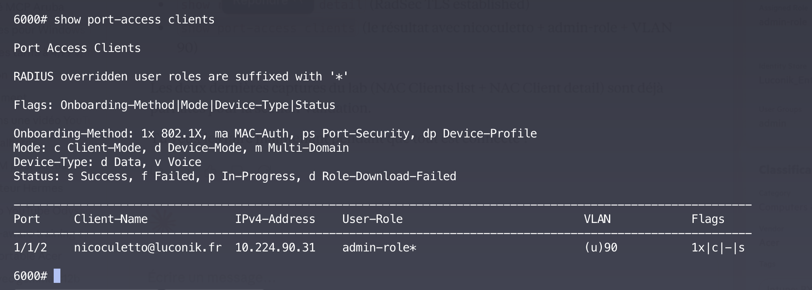

---

## Partie 2bis — Configuration du supplicant 802.1X sur Windows

> Cette section s'applique aux endpoints Windows **non gérés par une GPO ou un profil Intune 802.1X filaire**.

### Activer le service Wired AutoConfig

Ouvrir `services.msc`, localiser **Wired AutoConfig** (dot3svc).

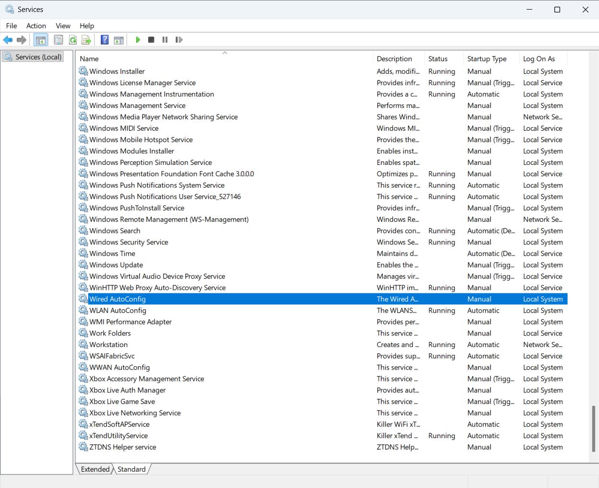

Double-cliquer → passer le démarrage en **Automatique** → **Démarrer**.

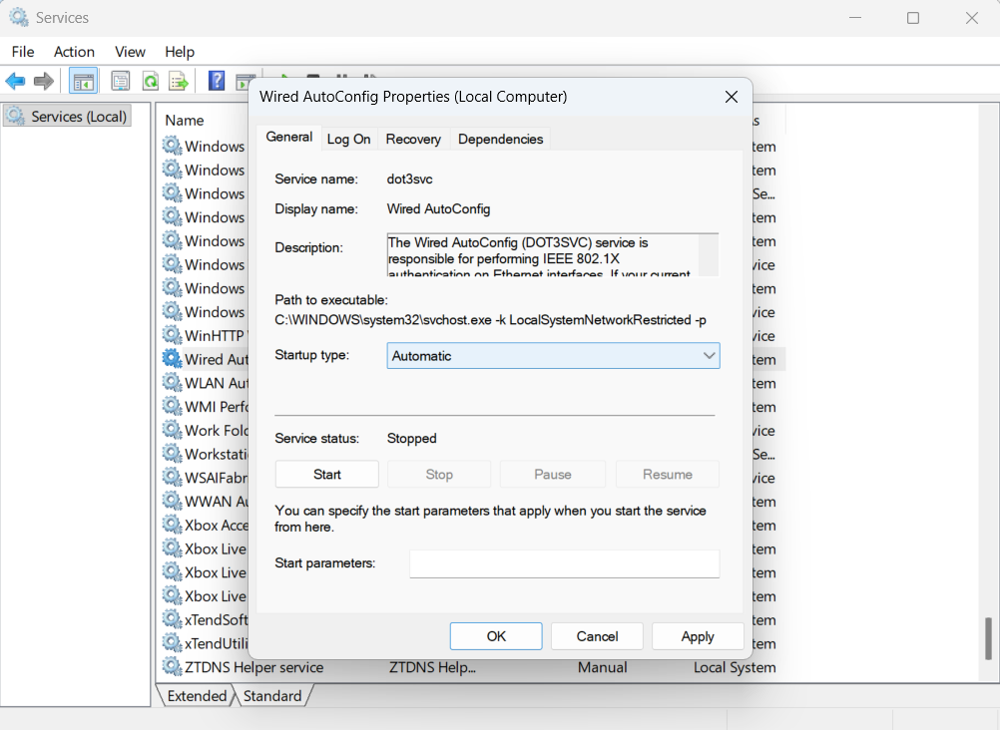

### Configurer l'authentification 802.1X sur la carte Ethernet

```
Panneau de configuration → Centre Réseau et partage
→ Modifier les paramètres de la carte
→ Clic droit Ethernet → Propriétés → Onglet Authentification
→ ✓ Activer l'authentification IEEE 802.1X
→ Méthode : Microsoft : Carte à puce ou autre certificat
→ Paramètres → ✓ Utiliser un certificat sur cet ordinateur
```

### Première connexion — sélection du certificat

Au branchement du câble, Windows affiche une notification **"Connecting, action needed"**.

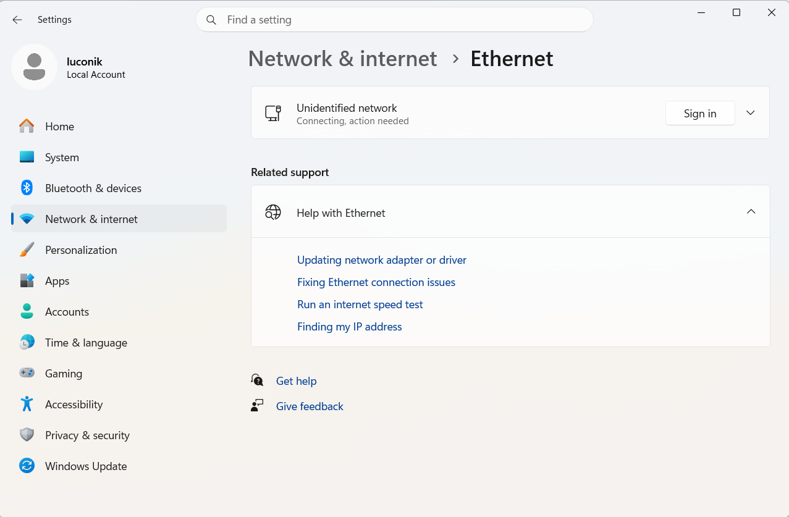

Cliquer **Connect** puis sélectionner le certificat `nicoculetto@luconik.fr`.

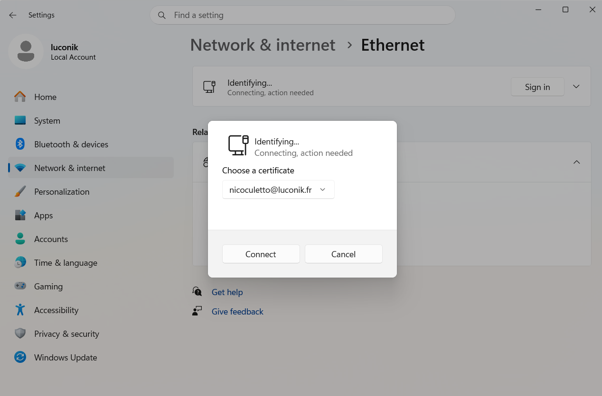

Une fois authentifié, le réseau passe en **Unidentified network** (comportement normal sur une connexion filaire 802.1X).

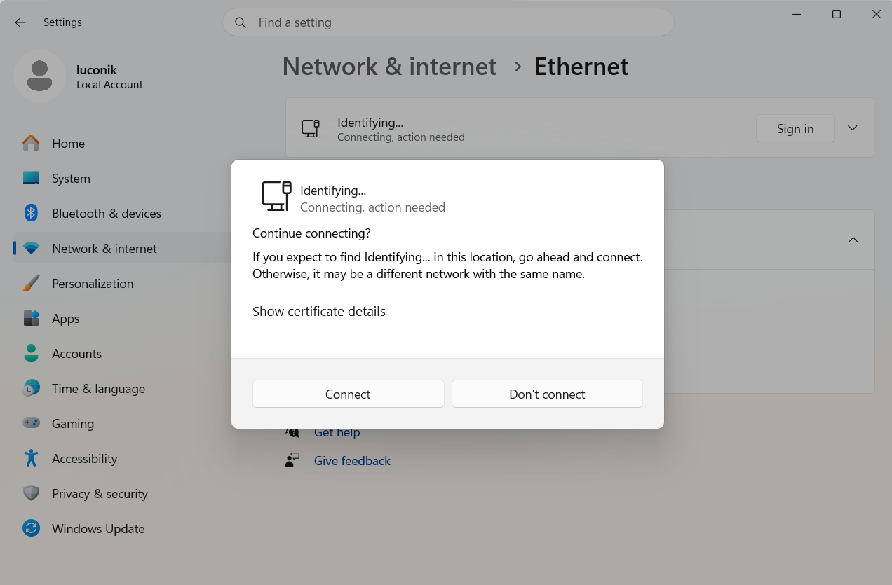

> **Note** — Sur les prochaines connexions, Windows sélectionne automatiquement le certificat sans intervention manuelle.

---

## Partie 3 — Validation

### 3.1 Central NAC — vue Clients

Naviguer vers :

```
Central NAC → Monitoring → Clients
```

| Champ | Valeur attendue |
|---|---|
| **Status** | Accepted |
| **Connection Type** | Wired |
| **Authentication Type** | EAP-TLS (Certificate) |
| **Certificate Status** | Valid |
| **Identity Store** | Luconik_EntraID |
| **Assigned Role** | selon la politique d'autorisation |
| **Tags** | Intune: Compliant |

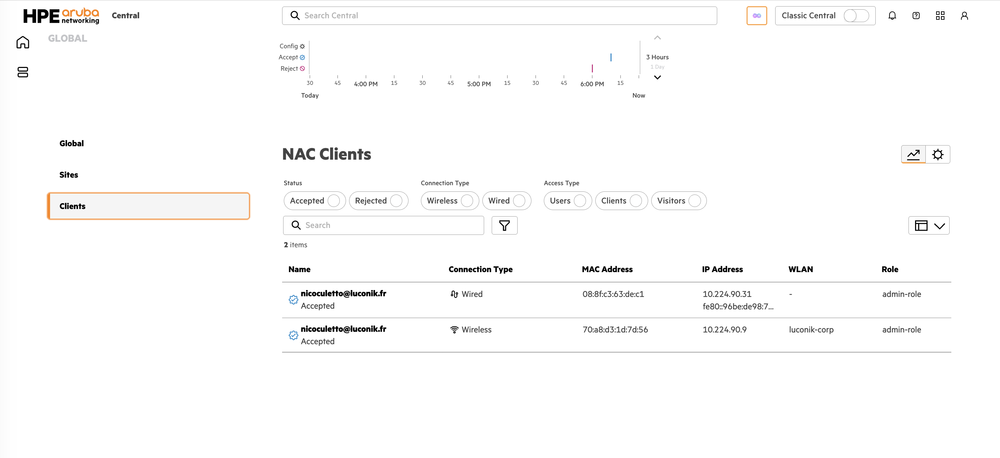

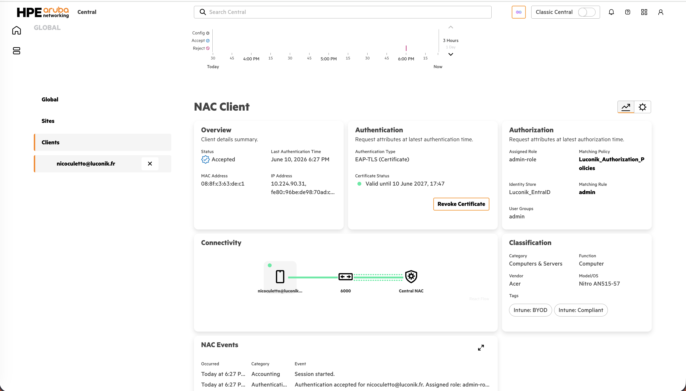

---

### 3.2 Validation CLI sur le switch CX

| Validation | Commande | Résultat attendu |
|---|---|---|
| Certificat Central NAC installé | `show crypto pki ta-profile sys_central_nac` | `TA Certificate: Installed and valid` |
| Connexion RadSec active | `show radius-server detail` | `TLS Connection Status: tls_connection_established` |
| Clients authentifiés | `show port-access clients` | Liste des clients avec rôle et VLAN |
| Listener CoA actif | `show radius dynamic-authorization` | Entrée CoA pour le FQDN Central NAC |

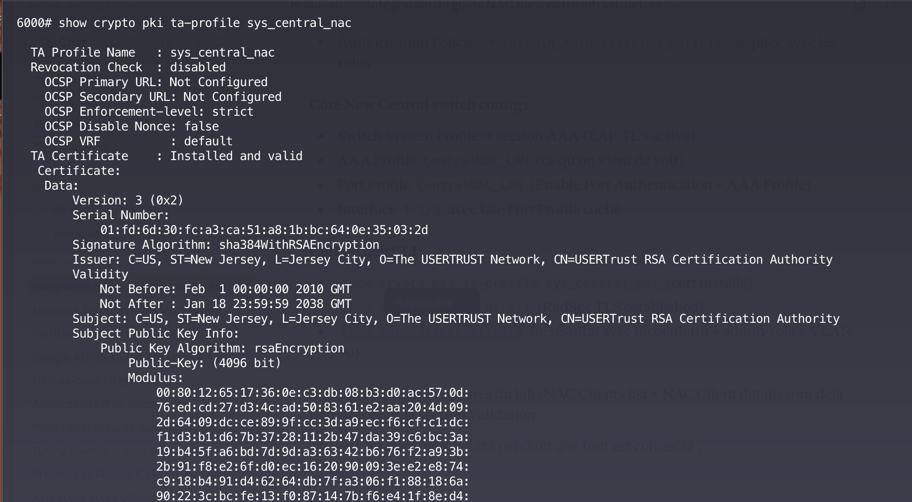

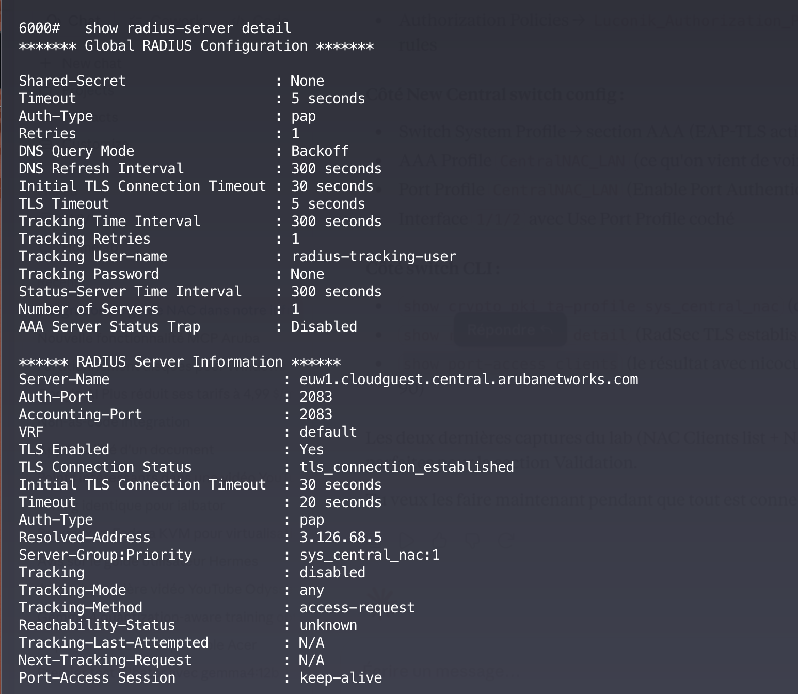

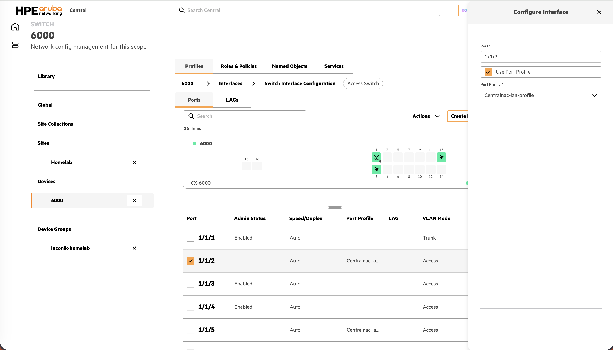

---

## Problèmes fréquents

| Problème | Cause probable |
|---|---|
| **Connexion RadSec down** | Port TCP-2083 bloqué entre le switch et Central NAC |
| **Certificat Central NAC non installé** | Profil système non correctement scopé ou non poussé |
| **Échec MAC auth — unexpected data error** | MAC Radius Auth Method non configuré en PAP |
| **Échec EAP-TLS — certificate validation error** | Certificat SCEP non encore déployé par Intune sur l'endpoint |
| **Échec EAP-TLS — identity store error** | Token OAuth expiré dans Central NAC — revalider l'Identity Store |
| **Rôle non appliqué / mauvais VLAN (CX 6000/6100)** | LUR absent sur le switch ou nom différent de la VSA `Aruba-User-Role` — DUR non supporté sur 6000/6100 |
| **Rôle non appliqué / mauvais VLAN (CX 6200+)** | Always Download Role non activé sur le rôle |
| **CoA non reçu par le switch** | `radius dyn-authorization` non poussé — vérifier le profil système et l'Audit Trail |
| **Heure système incorrecte sur l'endpoint** | Échec SCEP / validation certificat — synchroniser NTP avant l'enrollment Intune |

---

## Références

- 📘 [Guide de base filaire — willembargeman/hpe-networking-guides](https://github.com/willembargeman/hpe-networking-guides/blob/main/central-nac-cx-switch/README.md)
- 📘 [Central NAC — UEM Onboarding with Intune](https://arubanetworking.hpe.com/techdocs/NAC/central-nac/central-nac-uem-onboarding-intune/)
- 📘 [AOS-CX — Cached Critical Role](https://arubanetworking.hpe.com/techdocs/AOS-CX/10.17/HTML/security_5420-6200-6300-6400/Content/Chp_Port_acc/spe-cac-cri-rol.htm)
- 📘 [AOS-CX — Documentation Port Access](https://arubanetworking.hpe.com/techdocs/AOS-CX/10.17/HTML/security_5420-6200-6300-6400/Content/Chp_Port_acc/)
- [central-nac-intune](../central-nac-intune/README.md) — Guide Wi-Fi EAP-TLS (prérequis)
- [microsoft-intune / eap-tls](https://github.com/Luconik/microsoft-intune/tree/main/eap-tls) — Profils Intune par plateforme
