# Aruba Central NAC — EAP-TLS with Microsoft Intune

> 🇫🇷 [Français](README-fr.md) | 🇬🇧 English


---

## Table of contents

- [Overview](#overview)
- [Prerequisites](#prerequisites)
- [Part 1 — Aruba Central — Intune Extension](#part-1--aruba-central--intune-extension)
- [Part 2 — Aruba Central NAC Configuration](#part-2--aruba-central-nac-configuration)
- [Part 3 — Validation](#part-3--validation)
- [References](#references)

---

## Overview

This guide covers the **Aruba Central NAC** configuration for EAP-TLS certificate-based Wi-Fi authentication with Microsoft Intune as the UEM — NAC identity store, roles, authorization policies, SSID, and SCEP setup.

```
Endpoint (Intune-managed — Windows / macOS / iOS)
    │
    │  SCEP certificate issued by Central NAC CA
    ▼
Aruba AP (802.1X EAP-TLS)
    │
    │  RADIUS authentication
    ▼
Aruba Central NAC
    │
    │  Compliance check via OAuth2
    ▼
Microsoft Intune / Entra ID
    │
    ▼
Network access granted (role assigned by NAC policy)
```

> [!NOTE]
> This guide covers Central NAC configuration only. For Microsoft Intune profiles and device enrollment, see [microsoft-intune / eap-tls](https://github.com/Luconik/microsoft-intune/tree/main/eap-tls).

---

## Prerequisites

> [!IMPORTANT]
> **Complete the prerequisites before starting this guide.**
> The Entra ID App Registration (Tenant ID, Client ID, Client Secret) is required to configure the Aruba Central Intune extension and the NAC OAuth identity store.
> → [microsoft-intune / prerequisites](https://github.com/Luconik/microsoft-intune/tree/main/prerequisites)

- Active **HPE GreenLake** workspace with **Aruba Central** deployed
- **Microsoft Entra ID** App Registration configured — see [microsoft-intune / prerequisites](https://github.com/Luconik/microsoft-intune/tree/main/prerequisites)
- Active **Microsoft Intune** license
- Custom DNS domain verified in Entra ID
- Aruba APs managed in Aruba Central

| Component | Role |
|---|---|
| **Aruba Central NAC** | RADIUS server + NAC policy engine |
| **Microsoft Intune** | UEM — certificate and Wi-Fi profile management |
| **Microsoft Entra ID** | Identity directory + OAuth2 App Registration |
| **SCEP** | Client certificate distribution protocol |
| **EAP-TLS** | 802.1X certificate-based authentication method |

---

## Part 1 — Aruba Central — Intune Extension

### 1.1 Install the Microsoft Intune extension

Navigate to:
```
Aruba Central → Extensions → Available Extensions → Microsoft Intune → Install
```

<p align="center"></p>

<p align="center"></p>

---

### 1.2 Configure the Intune extension

Enter the App Registration credentials from the prerequisites:

| Field | Value |
|---|---|
| Tenant ID | From Entra ID overview |
| Client ID | Application (client) ID |
| Client Secret | Value from prerequisites step 0.4 |

<p align="center">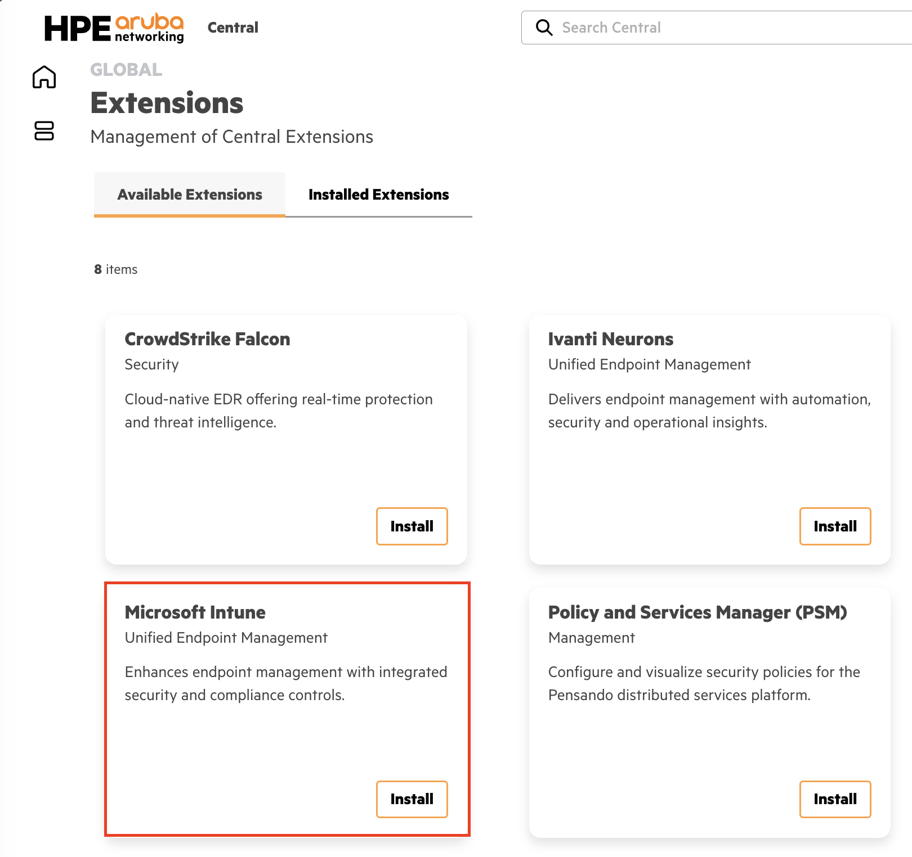</p>

---

## Part 2 — Aruba Central NAC Configuration

### 2.1 Configure OAuth Identity Store

Navigate to:
```
Central NAC → Configuration → Identity Management → Identity Stores → Create
```

<p align="center"></p>

<p align="center"></p>

<p align="center"></p>

Configure the OAuth redirect URI in the Entra ID enterprise app.

<p align="center">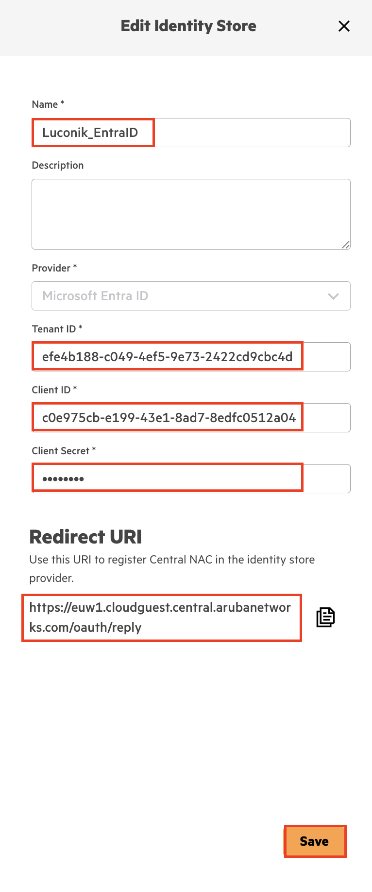</p>

<p align="center">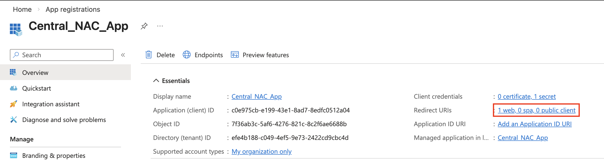</p>

<p align="center">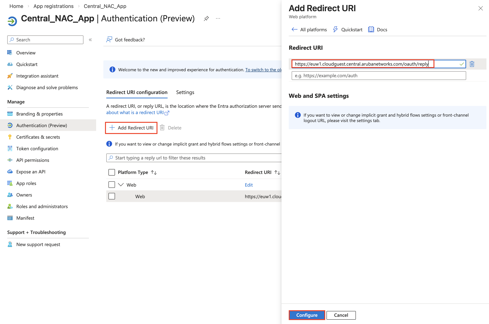</p>

<p align="center">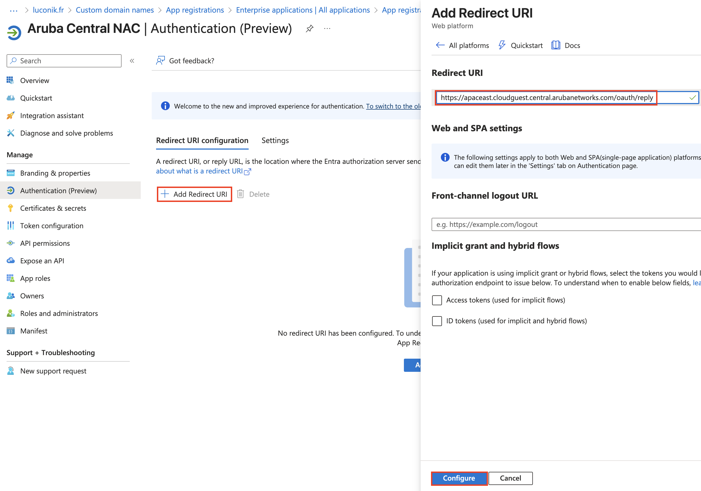</p>

Validate the OAuth token in Central NAC.

<p align="center">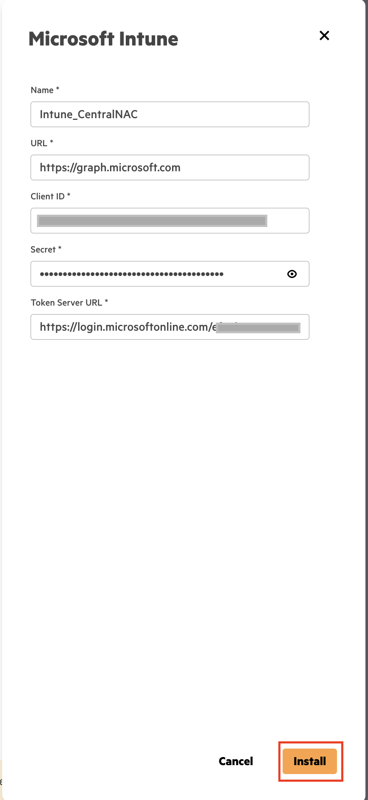</p>

---

### 2.2 Create NAC roles

Navigate to:
```
Central NAC → Configuration → Roles → Create Role
```

<p align="center"></p>

<p align="center">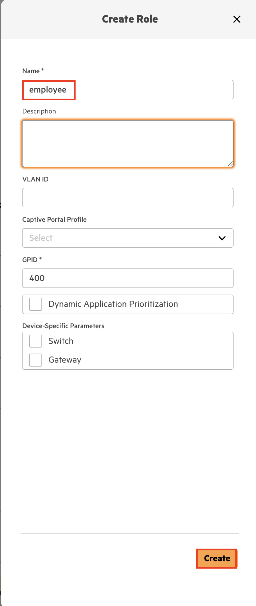</p>

<p align="center"></p>

---

### 2.3 Configure global NAC policy

Navigate to:
```
Central NAC → Configuration → Policies → Global Policy
```

<p align="center">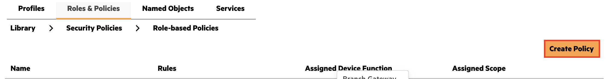</p>

<p align="center"></p>

<p align="center">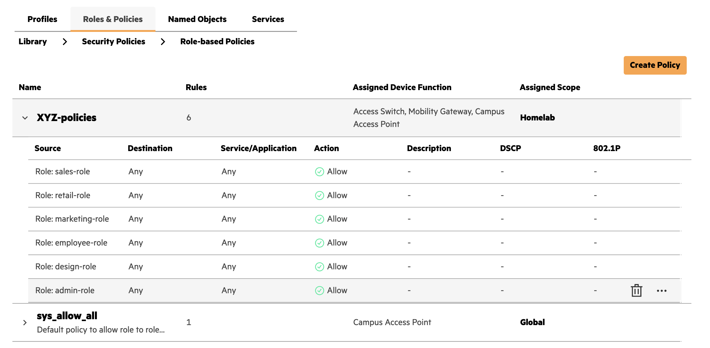</p>

---

### 2.4 Create 802.1X SSID profile

Navigate to:
```
Aruba Central → Configuration → WLANs → Create SSID
```

Configure the SSID with **WPA3-Enterprise / 802.1X**.

<p align="center">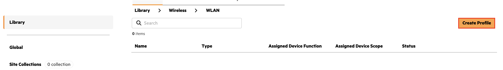</p>

<p align="center">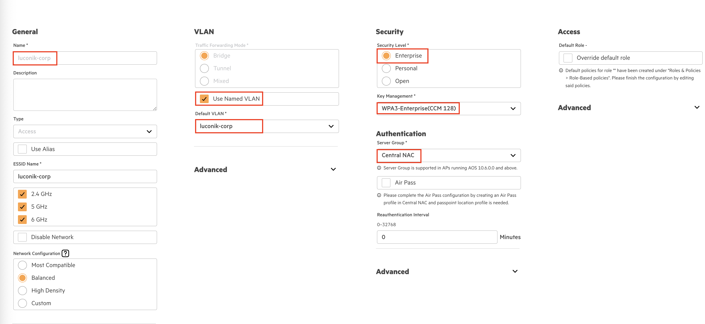</p>

<p align="center">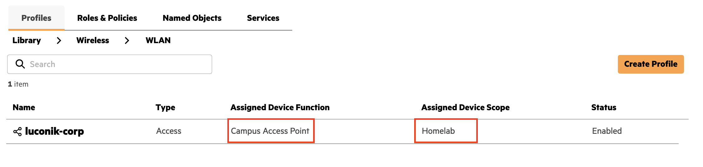</p>

---

### 2.5 Create authorization policy

Navigate to:
```
Central NAC → Configuration → Authorization Policies → Create
```

<p align="center"></p>

<p align="center">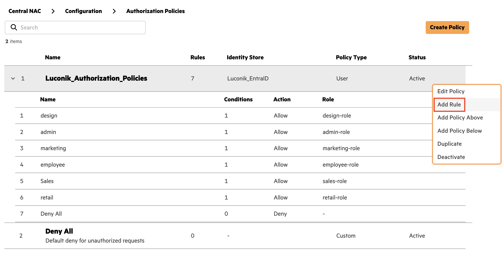</p>

<p align="center">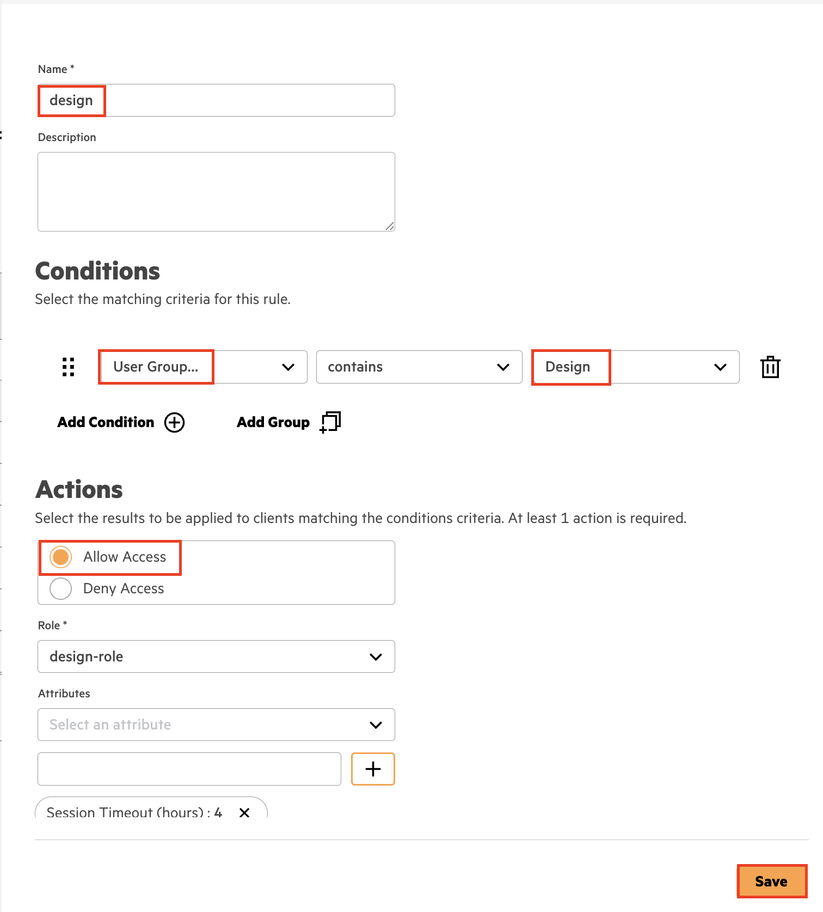</p>

---

### 2.6 Create EAP-TLS authentication profile

Navigate to:
```
Central NAC → Configuration → Authentication Profiles → Create Profile
```

Configure with **EAP-TLS** and the Intune Identity Store.

<p align="center"></p>

<p align="center">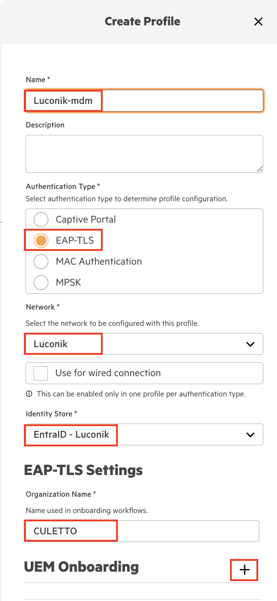</p>

<p align="center"></p>

<p align="center">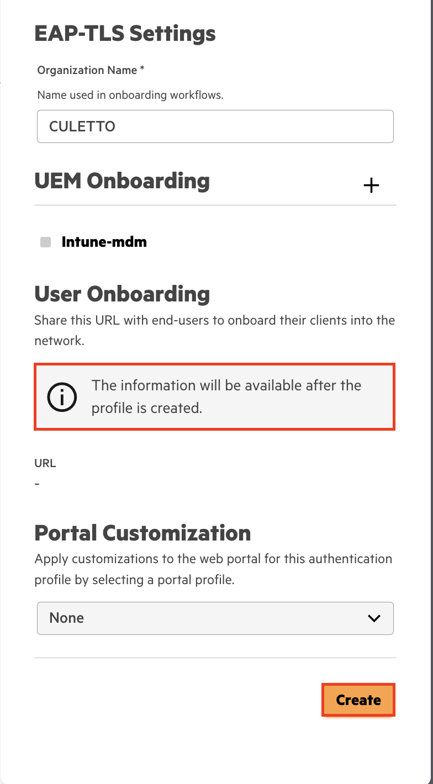</p>

---

### 2.7 Verify Intune UEM connection

The Intune connection must show **green** status in Central NAC.

<p align="center">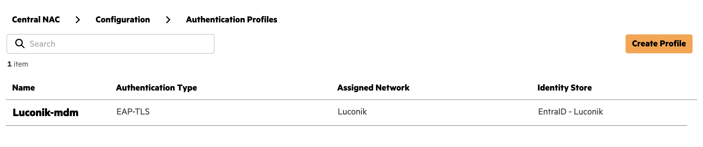</p>

---

### 2.8 Retrieve SCEP URL and root CA certificate

Navigate to:
```
Central NAC → Configuration → SCEP
```

<p align="center">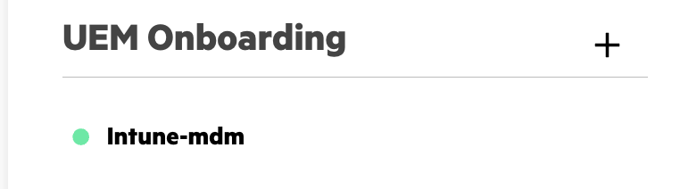</p>

Download the root CA certificate — required for the Trusted Certificate profile in Intune.

<p align="center"></p>

> [!NOTE]
> Keep both the **SCEP URL** and the **root CA certificate** — they are required in [microsoft-intune / eap-tls](https://github.com/Luconik/microsoft-intune/tree/main/eap-tls) for each platform guide.

---

## Part 3 — Validation

Navigate to:
```
Central NAC → Monitoring → Clients
```

Authenticated clients should appear with their assigned NAC role.

**Windows**

<p align="center">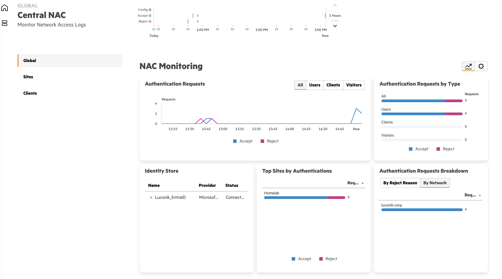</p>

<p align="center"></p>

<p align="center"></p>

**macOS**

<p align="center"></p>

<p align="center"></p>

**iOS/iPadOS**

<p align="center">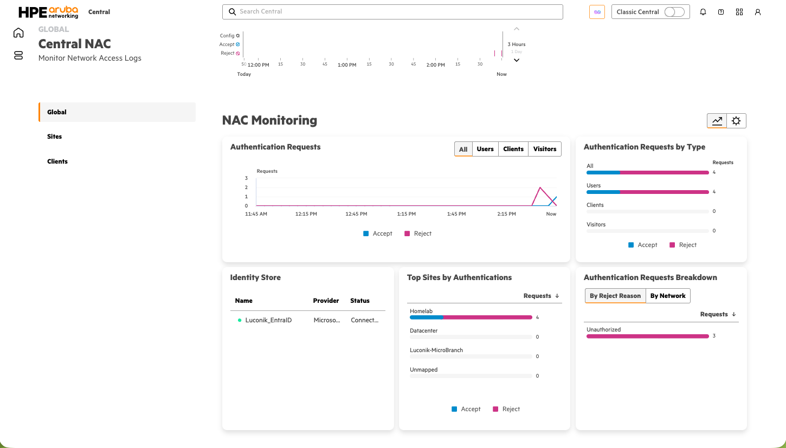</p>

<p align="center">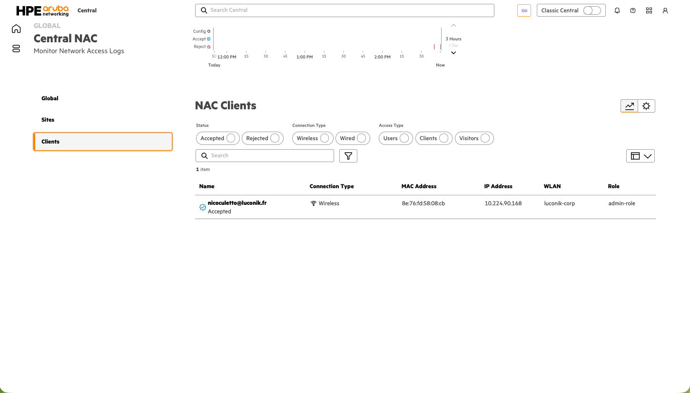</p>

<p align="center">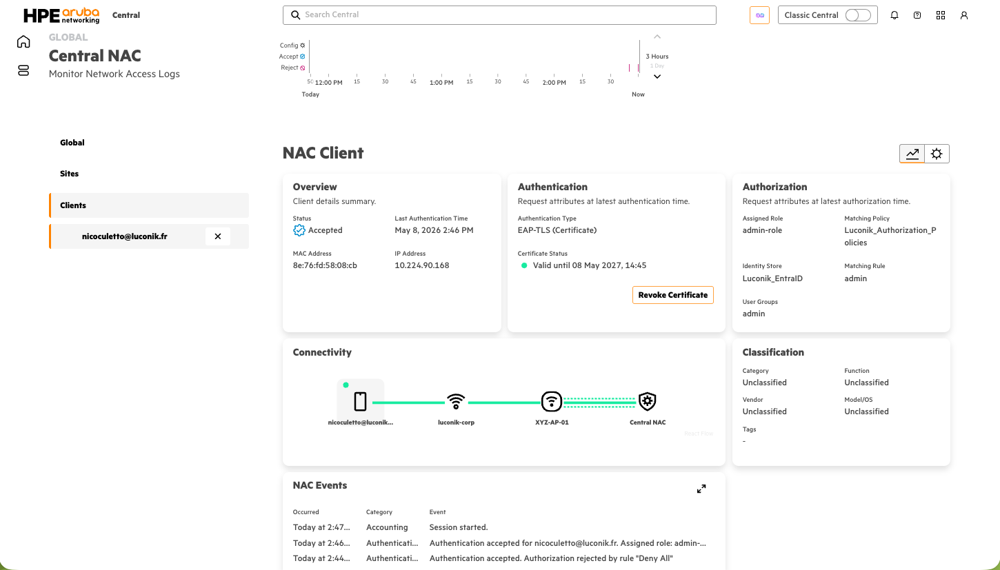</p>

For each platform, the client detail should show:

| Field | Expected value |
|---|---|
| Status | Accepted |
| Authentication Type | EAP-TLS (Certificate) |
| Certificate Status | Valid |
| Identity Store | Luconik_EntraID |
| Assigned Role | per authorization policy |

---

## References

- 📘 [Aruba Central NAC — UEM Onboarding with Intune](https://arubanetworking.hpe.com/techdocs/NAC/central-nac/central-nac-uem-onboarding-intune/)
- [Aruba Central Documentation](https://www.arubanetworks.com/techdocs/central/latest/content/)
- [Microsoft Intune — SCEP Certificate Profiles](https://learn.microsoft.com/en-us/mem/intune/protect/certificates-scep-configure)
- [Microsoft Entra ID — App Registration](https://learn.microsoft.com/en-us/entra/identity-platform/quickstart-register-app)
- [microsoft-intune / prerequisites](https://github.com/Luconik/microsoft-intune/tree/main/prerequisites) — Entra ID App Registration + APNs
- [microsoft-intune / eap-tls](https://github.com/Luconik/microsoft-intune/tree/main/eap-tls) — Intune profiles + enrollment per platform

---

## File structure

```
central-nac-intune/
├── README.md               ← This file (EN)
├── README-fr.md            ← French version
└── screenshots/
    ├── 00-aruba-central-nac-banner.png
    ├── 15-aruba-central-intune-extension-menu.png
    ├── ...
    ├── 44-aruba-central-nac-scep-certificate-download.png
    ├── 68-test-aruba-central-nac-monitoring-clients.png
    ├── 69-test-aruba-central-nac-monitoring-clients-list.png
    ├── 70-test-aruba-central-nac-client-detail.png
    ├── 124-central-nac-clients-accepted.png
    ├── 125-central-nac-client-detail-eap-tls.png
    ├── 221-central-nac-monitoring-global.png
    ├── 222-central-nac-clients-accepted.png
    └── 223-central-nac-client-detail-accepted.png
```

---

*Last updated: May 2026 — [@Luconik](https://github.com/Luconik)*
