# Linux Ubuntu 24.04 — Network Access via Entra ID with Central NAC

This consolidated document covers two complementary steps to enable a Linux Ubuntu 24.04 machine to authenticate on a corporate Wi-Fi network using Microsoft Entra ID:

1. **Intune Enrollment** — device registration for compliance management
2. **Central NAC Captive Portal** — network access via Entra ID authentication (workaround for Linux profile limitations in Intune)

> **Context**: Intune does not offer native configuration profiles on Linux (Wi-Fi EAP-TLS, SCEP/Trusted certificates). Intune enrollment only manages device compliance. For network access, the flow described in Part 2 (Central NAC captive portal with Entra ID) is the operational workaround.

---

# Part 1 — Microsoft Intune Enrollment on Ubuntu 24.04

## Prerequisites

- Ubuntu Desktop **24.04 LTS** (Noble Numbat), amd64 architecture
- Microsoft Entra ID account with an active Intune license
- Internet access to packages.microsoft.com
- Sudo privileges on the machine

---

## 1. Installing the Intune Portal Agent

### Why not use the official script?

The `installer.sh` script available on the Microsoft GitHub repository has a known bug on Ubuntu 24.04: the `EDGE_GPG_KEY` variable is unbound (line 277), causing the script to abort:

```
./installer.sh: line 277: EDGE_GPG_KEY: unbound variable
```

### Manual installation via apt

```bash
# 1. Download and install the Microsoft GPG key
curl https://packages.microsoft.com/keys/microsoft.asc | gpg --dearmor > microsoft.gpg
sudo install -o root -g root -m 644 microsoft.gpg /usr/share/keyrings/
sudo rm microsoft.gpg

# 2. Add the Microsoft repository for Ubuntu 24.04 (Noble)
sudo sh -c 'echo "deb [arch=amd64 signed-by=/usr/share/keyrings/microsoft.gpg] \
https://packages.microsoft.com/ubuntu/24.04/prod noble main" \
> /etc/apt/sources.list.d/microsoft-ubuntu-noble-prod.list'

# 3. Update and install
sudo apt update && sudo apt install intune-portal -y
```

The following packages are installed automatically:

| Package | Description |
|---|---|
| `intune-portal` | Intune Portal application (v1.2604.x) |
| `microsoft-identity-broker` | Microsoft authentication broker (v3.0.x) |

> **Note**: If a `microsoft-prod.list` file already exists in `/etc/apt/sources.list.d/`, remove it first: `sudo rm /etc/apt/sources.list.d/microsoft-prod.list`

### Reload systemd after installation

```bash
systemctl --user daemon-reload
```

---

## 2. Device Enrollment

### Launching the application

```bash
intune-portal
```

The **Intune Agent** welcome screen appears. Click **Sign in**.

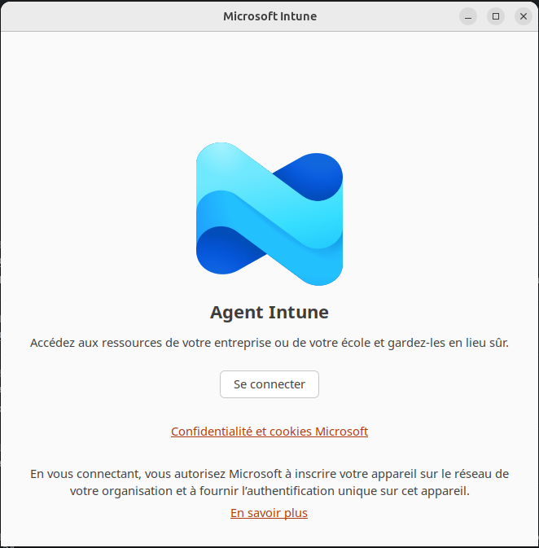

### Entra ID Authentication

The Microsoft Sign in window opens. Enter the organizational account email address and click **Next**.

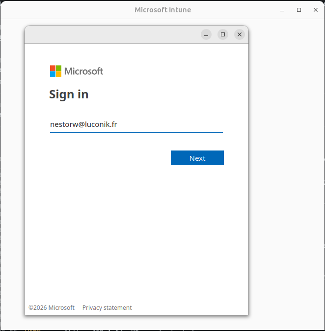

Enter the account password and click **Sign in**.

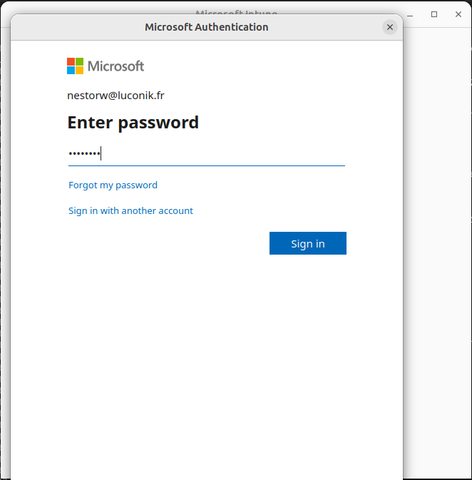

### Device Registration (MFA)

If a Conditional Access policy is in place, a **"Help us keep your device secure"** step appears. Click **Register**.

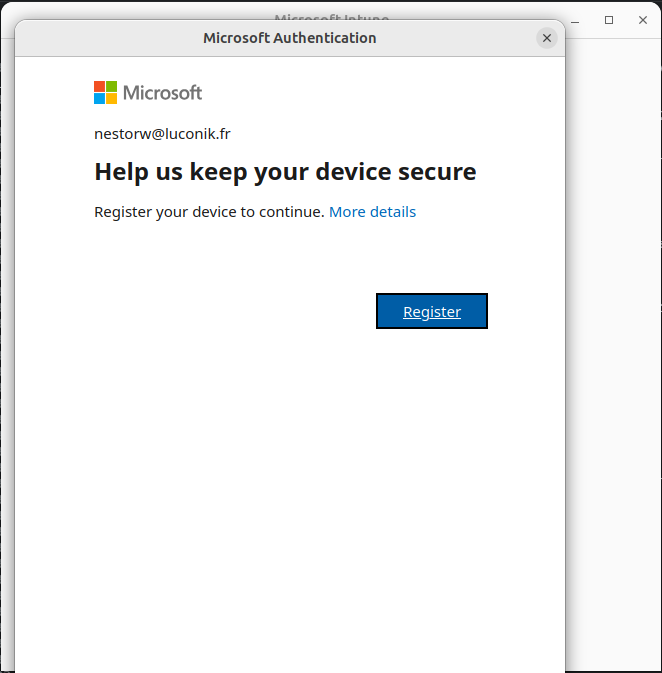

If MFA is enabled on the account, enter the code displayed in the **Microsoft Authenticator** app and click **Verify**.

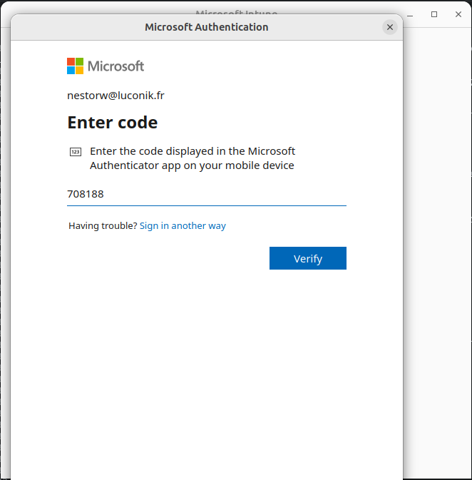

### Company Portal — Access Setup

After authentication, the portal displays the **Set up access** screen. Click **Begin**.

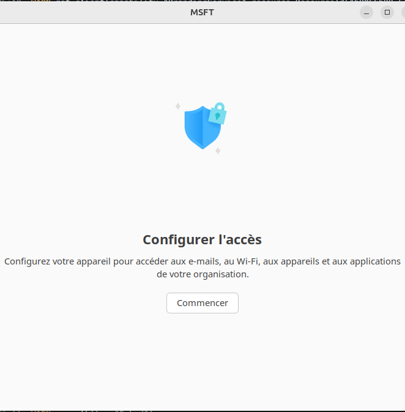

The next screen shows what information your organization can see on the device. Click **Begin** to confirm consent.

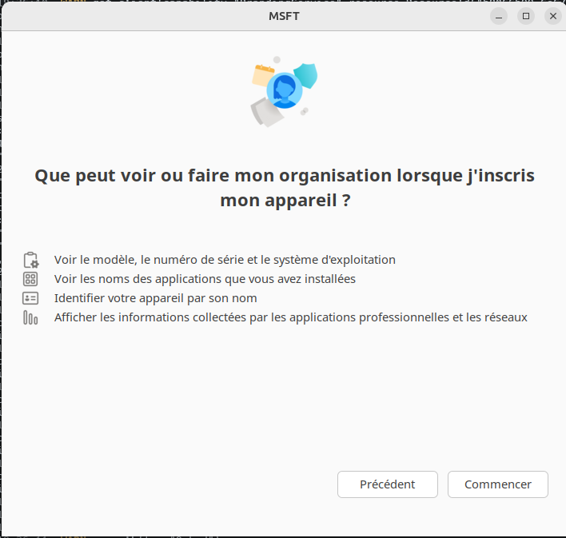

### Enrollment in Progress

Enrollment starts automatically. The **Registering your device** screen appears for a few seconds.

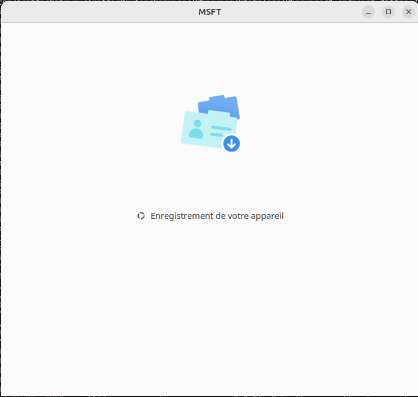

### Post-enrollment Result

Once enrollment is complete, the app displays the device card with its name, manufacturer, and operating system.

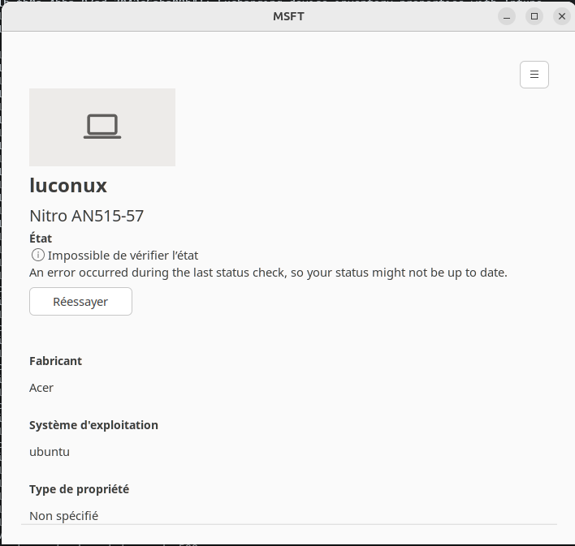

> **Note**: The **"Unable to verify status"** message is normal at this stage — no compliance policy has been assigned yet. This corresponds to the IWS 500 error visible in the logs, and has no impact on enrollment.

---

## 3. Administration Verification

### Linux Device List

In the **Microsoft Intune admin center**, navigate to **Devices > Linux devices**.

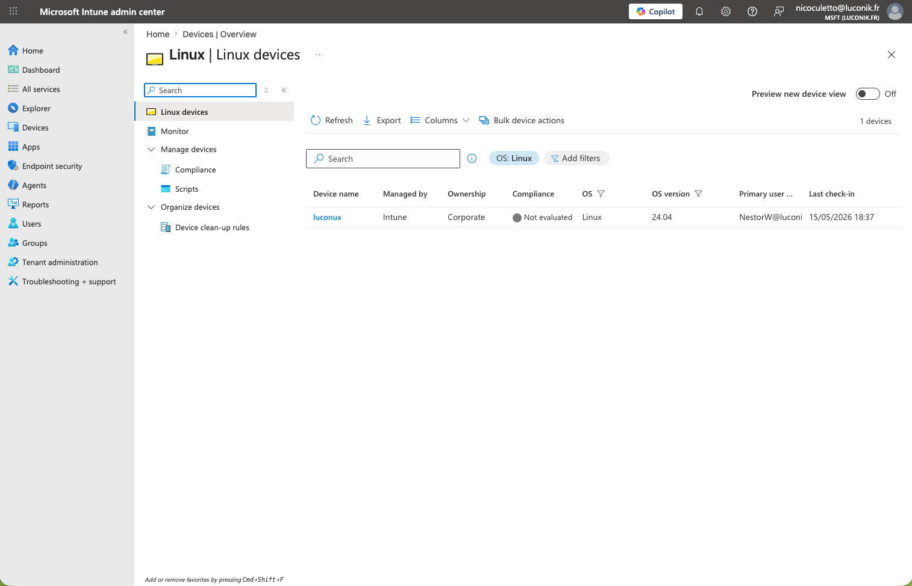

| Field | Value |
|---|---|
| Managed by | `Intune` |
| Ownership | `Corporate` |
| OS | `Linux` |
| OS version | `24.04` |
| Compliance | `Not evaluated` |

### Device Detail

Click on the device name to view its details:

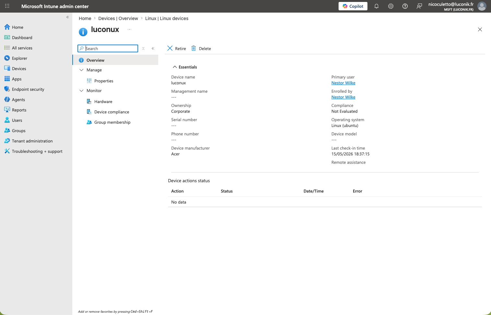

---

## 4. Limitations — Linux Configuration Profiles

**Intune offers no native configuration profiles for Linux.** Navigating to **Devices > Configuration > Create > Linux**, the *Profile type* menu shows **No available items**.

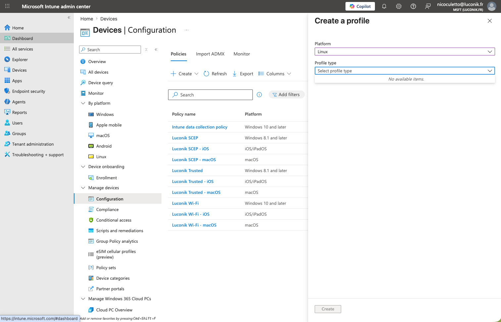

| Feature | Windows | macOS | iOS | Linux |
|---|---|---|---|---|
| Wi-Fi EAP-TLS Profile | Yes | Yes | Yes | **No** |
| SCEP Certificate Profile | Yes | Yes | Yes | **No** |
| Trusted Certificate Profile | Yes | Yes | Yes | **No** |
| Compliance Policy | Yes | Yes | Yes | Yes |
| Scripts | Yes | Yes | No | Yes |
| MDM Enrollment | Yes | Yes | Yes | Yes |

> **Workaround**: For Wi-Fi network access on Linux, use the **Entra ID captive portal** flow described in Part 2.

---

## Intune Troubleshooting

### Error `EDGE_GPG_KEY: unbound variable`

Use the manual installation method described in Section 1.

### Duplicate repository warning

```
W: Target Packages is configured multiple times in microsoft-prod.list
   and microsoft-ubuntu-noble-prod.list
```

```bash
sudo rm /etc/apt/sources.list.d/microsoft-prod.list
sudo apt update
```

### "Unable to verify status" in the app

The IWS 500 error post-enrollment is related to the Company Portal display service on Microsoft's side. **It does not affect enrollment or policy delivery.** The device is properly registered and visible in the admin center.

### Viewing logs

```bash
cat ~/intune-installer.log
journalctl --user -u intune-agent.timer -f
```

---

# Part 2 — Workaround: Central NAC Captive Portal with Entra ID (Linux)

## Context

This procedure allows Linux users to connect to the network via a captive portal authenticated with Entra ID, **without an EAP-TLS certificate or Intune Wi-Fi profile** — working around the limitations described in Part 1, Section 4.

The infrastructure configuration steps are:

1. Creating the **SSID** in New Central
2. Configuring the **Portal Profile** in Central NAC
3. Configuring the **Captive Portal Authentication Profile** in Central NAC

---

## 1. Creating the SSID

From the New Central dashboard, navigate to **Global > Network Overview**, then click the configuration icon (gear icon) in the top right.

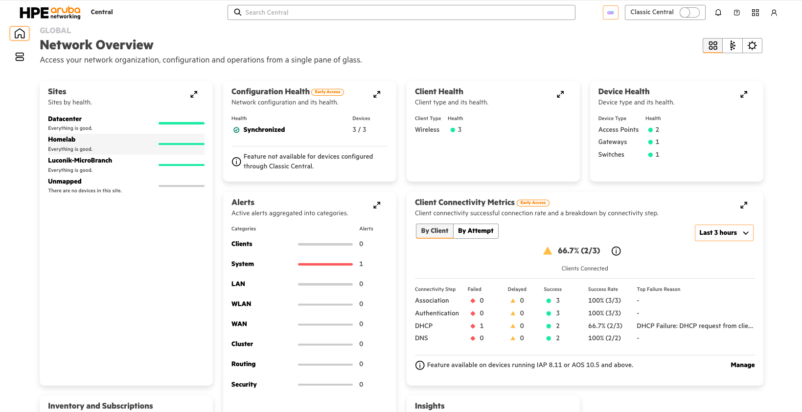

In the left menu, select **Library**, then navigate to **Profiles Management > Wireless > WLAN** and click **Manage**.

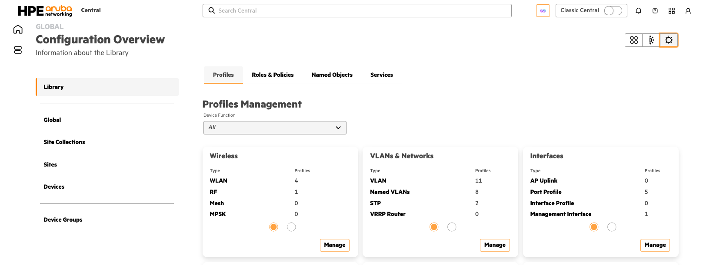

Click **Create Profile** and fill in the following parameters:

| Parameter | Value |
|---|---|
| Profile Name | `Luconik-invite` |
| ESSID Name | `Luconik-invite` |
| Default VLAN | `1` |
| Security Level | `Open` |
| Key Management | `Enhanced Open` |
| Captive Portal Type | `Central NAC` |

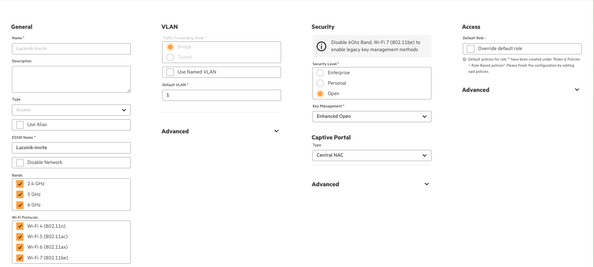

> **Note:** Security Level `Open` with Key Management `Enhanced Open` (OWE) provides opportunistic encryption without a pre-shared key, suitable for a captive portal.

---

## 2. Configuring the Portal Profile

Navigate to **Global > Central NAC > Configuration > Portal Customization > Portal Profiles**.

Create or edit a profile with the following parameters:

| Parameter | Value |
|---|---|
| Name | `Luconik_Portal_Profiles_Entra` |
| Require user to accept terms | Enabled |
| Show terms | `Show terms on the sign-in page` |
| Theme | `Use system default theme` |
| Overrides | `None` |

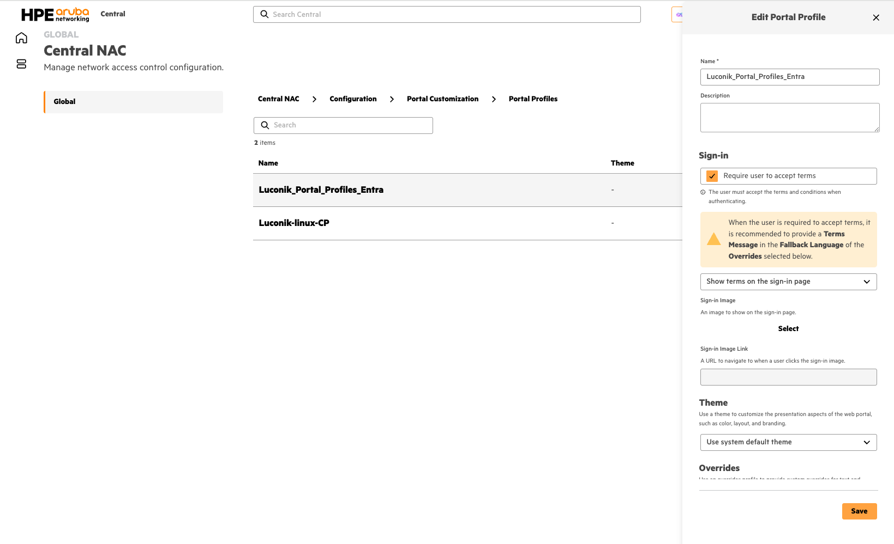

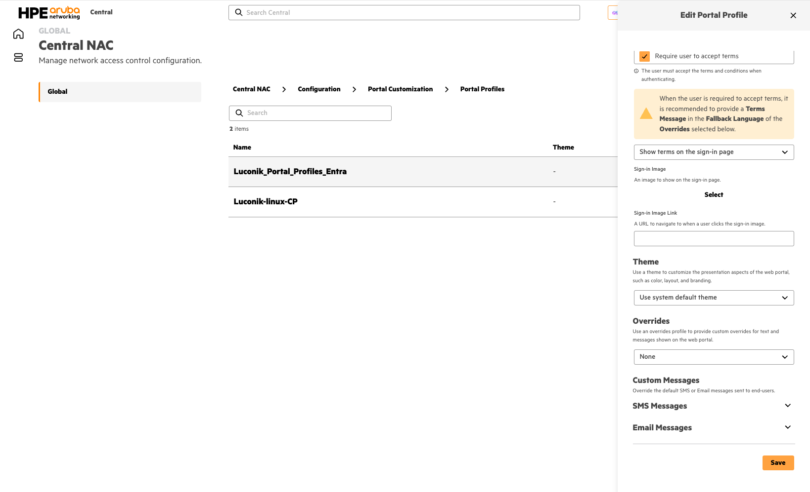

> **Note:** Enabling "Require user to accept terms" requires the user to check the terms and conditions before authenticating.

---

## 3. Configuring the Authentication Profile

Navigate to **Global > Central NAC > Configuration > Authentication Profiles**.

Select the `Luconik_Captive_Portal` profile or create a new one with the following parameters:

| Parameter | Value |
|---|---|
| Name | `Luconik_Captive_Portal` |
| Authentication Type | `Captive Portal` |
| Network | `Luconik-invite` |
| Authentication | `Users sign in with an account` |
| Identity Stores | `Luconik_Visitor`, `Luconik_EntraID` |
| Allow users to register an account | Enabled |

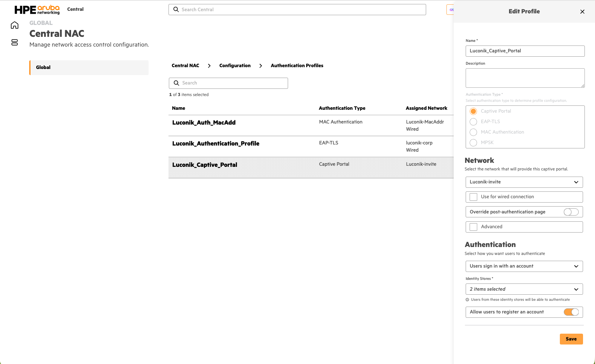

The selected Identity Stores allow authentication via Entra ID (`Luconik_EntraID`) or via a local guest account (`Luconik_Visitor`).

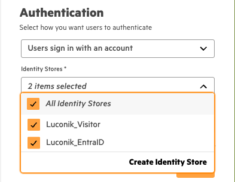

At the bottom of the panel, configure the additional parameters:

| Parameter | Value |
|---|---|
| Registered user identity store | `Luconik_Visitor` |
| Register | `Register email address only` |
| Expire registered accounts after | `1 day` |
| Portal Customization | `Luconik_Portal_Profiles_Entra` |

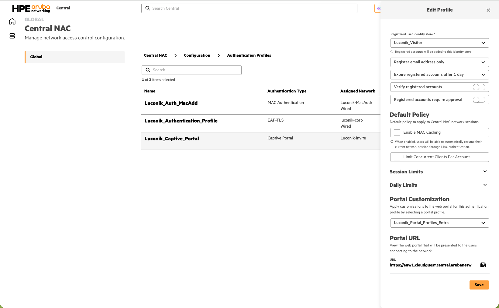

Click **Save**.

---

## Linux User Experience

### Connecting to the Network

In the system notification bar, click the **Wi-Fi** button and select the `Luconik-invite` network from the list of available networks.

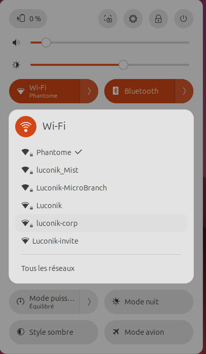

A system notification appears confirming the connection to the network.

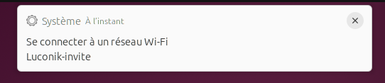

### Captive Portal Authentication

The browser opens automatically on the captive portal. Three authentication methods are available:

- **Sign in**: with a local guest account (username + password)
- **Register**: to create a guest account
- **Sign in with Luconik_EntraID**: authentication via the organization's Microsoft Entra ID account

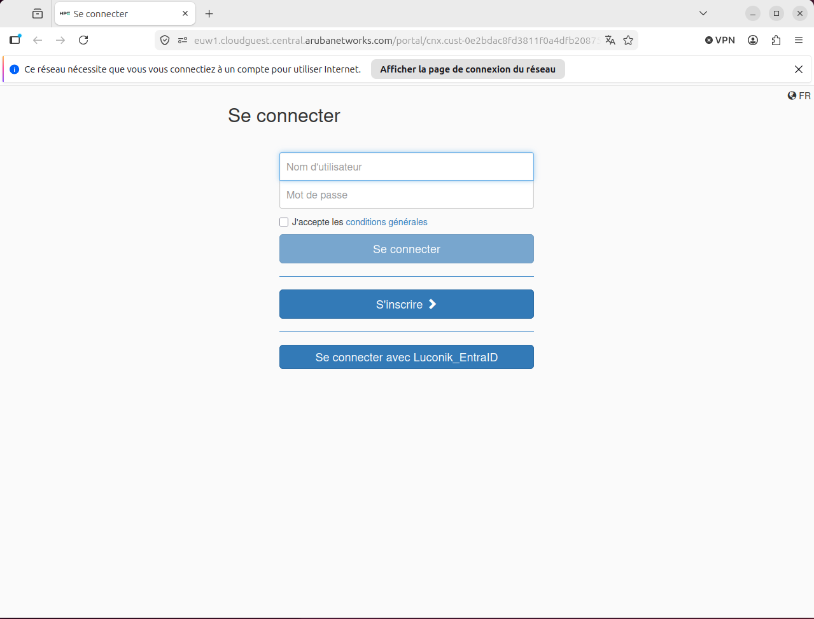

Click **Sign in with Luconik_EntraID**.

### Accepting Terms and Conditions

If the Portal Profile is configured with terms acceptance, an intermediate page is displayed. Check **I accept the terms and conditions** and click **Accept**.

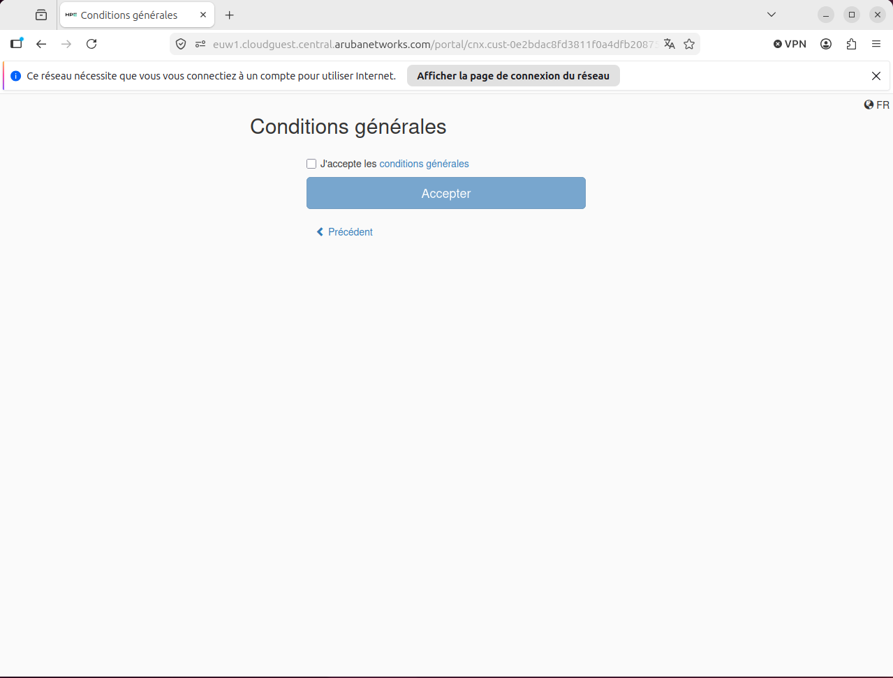

### Entra ID Authentication

The Microsoft page appears. Select the organizational account or enter one manually.

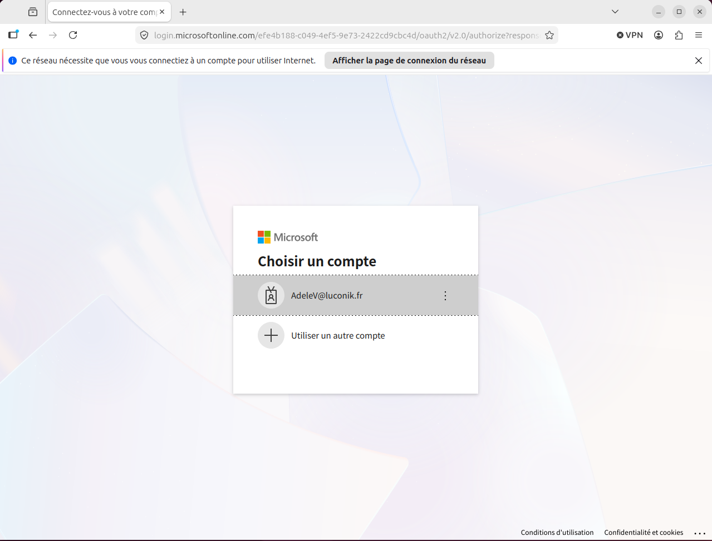

Enter the Microsoft account password and click **Sign in**.

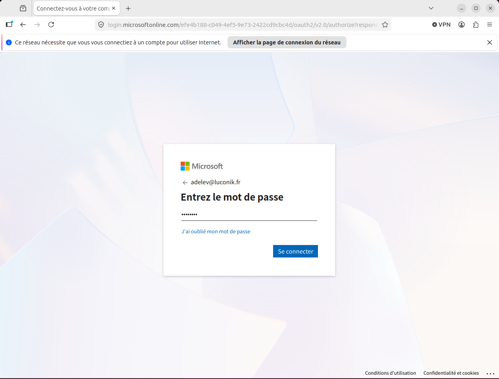

If a "Stay signed in?" prompt appears, click **Yes** to reduce reconnection prompts in future sessions.

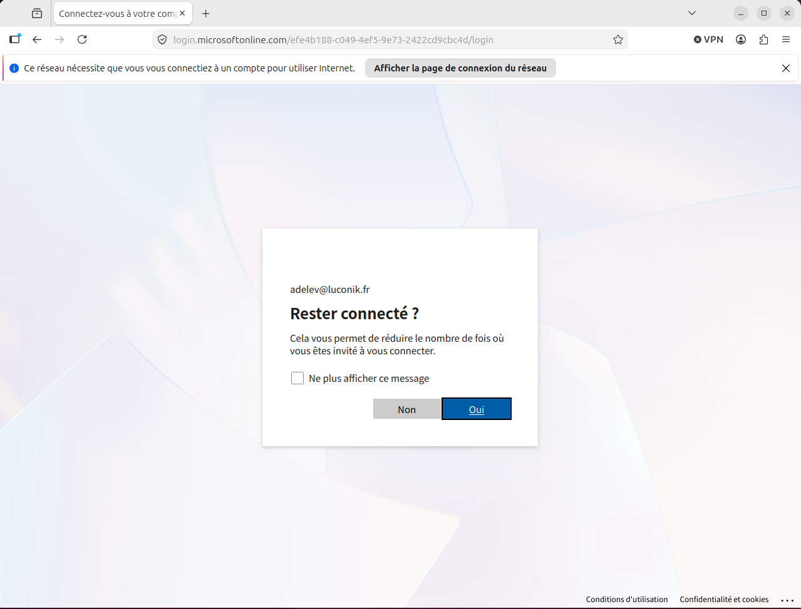

### Network Access

Once authentication is successful, the browser redirects to the default web page configured in the Portal Profile. Internet access is granted.

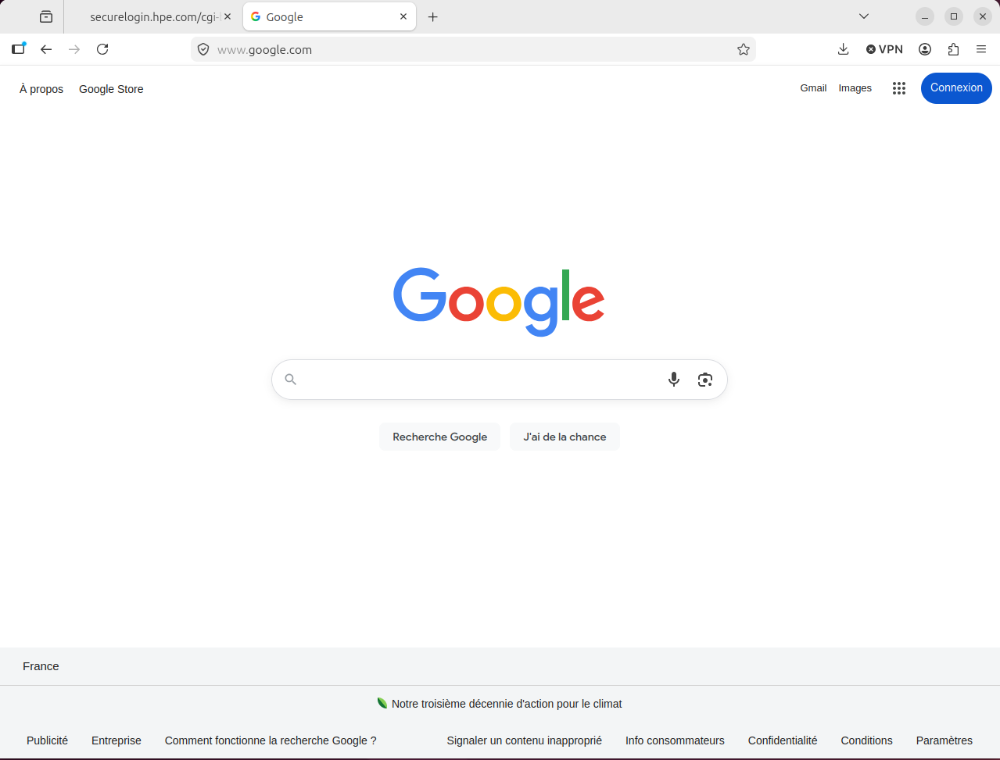

---

## Administration Verification

### Connected Clients List

Navigate to **Global > Central NAC > Monitor > Clients** to view the list of authenticated clients.

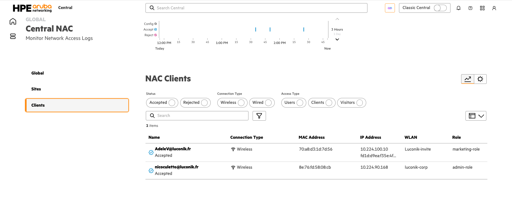

The user's session should appear with status **Accepted**, connection type **Wireless**, and WLAN **Luconik-invite**.

### Client Session Detail

Click on a client to view the session detail and verify:

- **Status**: `Accepted`
- **Authentication Type**: `Captive Portal`
- **Captive Portal Name**: `Luconik_Captive_Portal`
- **Identity Store**: `Luconik_EntraID`
- **Assigned Role**: role assigned by the authorization policy

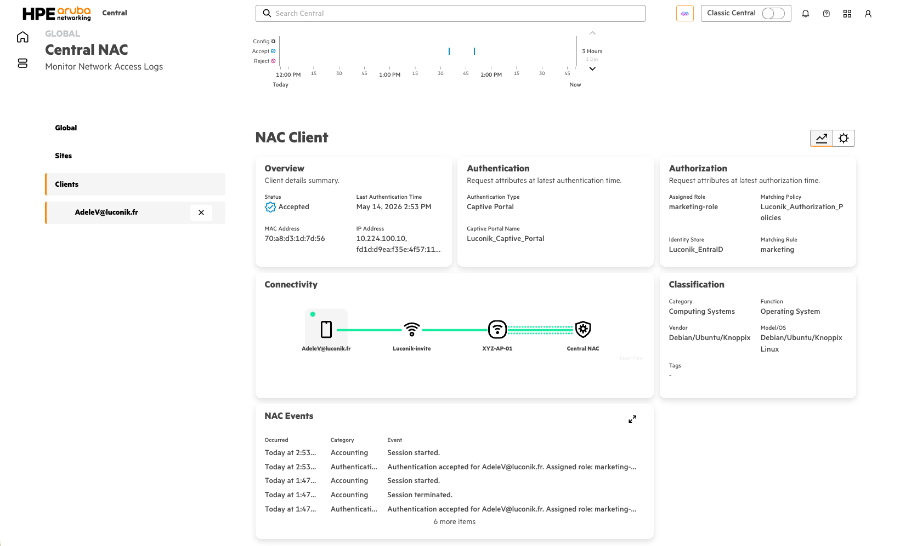

The connectivity diagram confirms the path: user → SSID → AP → Central NAC.
