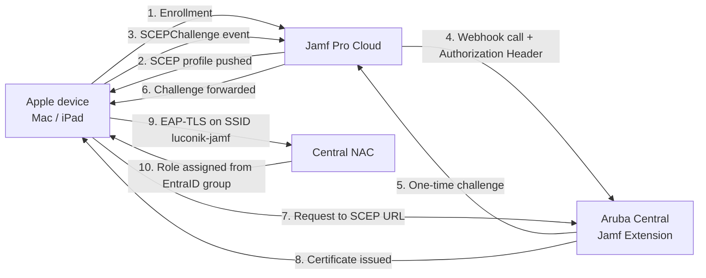

# Aruba Central NAC — EAP-TLS with Jamf Pro (Part 1/2: Aruba Central)

> This document covers the **Aruba Central** side of the Central NAC ↔ Jamf Pro integration for certificate-based EAP-TLS authentication. The **Jamf Pro** side (PKI, configuration profiles, device enrollment) is covered in the companion repo [`jamf-pro/eap-tls`](https://github.com/Luconik/hpe-aruba-guides/tree/main/jamf-pro/eap-tls) — see [References](#references).
>
> This integration is not documented anywhere else to date, neither by HPE nor by Jamf. This document aims to fill that gap.

## Table of contents

- [Overview](#overview)
- [Prerequisites](#prerequisites)
- [Part 1 — Aruba Central: Jamf Extension](#part-1--aruba-central-jamf-extension)
  - [1.1 Install the Jamf extension](#11-install-the-jamf-extension)
  - [1.2 Configure the extension](#12-configure-the-extension)
  - [1.3 Retrieve the SCEP URL, Webhook URL, and Authorization Header](#13-retrieve-the-scep-url-webhook-url-and-authorization-header)
- [Part 2 — Aruba Central NAC Configuration](#part-2--aruba-central-nac-configuration)
  - [2.1 Configure the OAuth EntraID identity store](#21-configure-the-oauth-entraid-identity-store)
  - [2.2 Create NAC roles](#22-create-nac-roles)
  - [2.3 Configure the global NAC policy](#23-configure-the-global-nac-policy)
  - [2.4 Create the 802.1X SSID profile](#24-create-the-8021x-ssid-profile)
  - [2.5 Create the authorization policy](#25-create-the-authorization-policy)
  - [2.6 Create the EAP-TLS authentication profile](#26-create-the-eap-tls-authentication-profile)
- [Part 3 — Validation](#part-3--validation)
- [References](#references)
- [File structure](#file-structure)

## Overview

**Validated architecture:**

| Component | Value |
|---|---|
| Subscription | Aruba Central NAC — **Central Foundation** |
| Identity store | Microsoft EntraID |
| UEM | Jamf Pro Cloud (`<jamf-tenant>.jamfcloud.com`) |
| Cloud IdP (Jamf side) | Microsoft EntraID |
| SSID | `luconik-jamf` |
| SSID security | WPA3-Enterprise (CCMP-128) |
| Server Group | Central NAC |
| Tested devices | MacBook Pro M1 (macOS 26.6.2), iPad Pro 11 (iPadOS 26.6.1) |

> ℹ️ **Note — subscription tier.** The Jamf integration described here is available with the **Central Foundation** subscription. The higher-tier Central license is only required for multi-IdP or personal-certificate use cases — neither of which is used in this lab.



## Prerequisites

- Aruba Central NAC — **Central Foundation** subscription
- EntraID identity store already configured in Central (App Registration, permissions)
- Jamf Pro Cloud, **version 10.32 or later** (lab validated on `11.31.1-t1787060595569`)
- Jamf Pro account with admin rights to create an API role/client (see repo [`jamf-pro/eap-tls`](https://github.com/Luconik/hpe-aruba-guides/tree/main/jamf-pro/eap-tls) for the exact API privileges)
- Existing EntraID groups for NAC role mapping

> ⚠️ **Gotcha — Entra secret referenced in two places.** The Entra client secret is used in both the Jamf MDM extension and the Central identity store. Regenerating it in Entra invalidates both references at once — it must be updated in both places after regeneration.
>
> ⚠️ **Gotcha — Value vs Secret ID.** On the Entra side, when creating the secret, copy the **Value**, not the **Secret ID**. A common mistake that silently breaks the extension's authentication.

## Part 1 — Aruba Central: Jamf Extension

### 1.1 Install the Jamf extension

1. In Aruba Central, open **Global** → **Maintenance** → **Extensions** (**Available Extensions** tab).
2. In the catalog, locate the **Jamf** extension — it exists natively, alongside the Intune extension.

   

3. Click **Install** on the Jamf card.

### 1.2 Configure the extension

The install form doubles as the configuration form — there is no separate naming step before credential configuration.

1. Name the instance (e.g. `<jamf-instance-name>`) and leave the type set to **Jamf Pro**.
2. Enter the Jamf Pro instance **URL**: `<jamf-tenant>.jamfcloud.com`.
3. Under **Connect Using**, select **OAuth**.
4. Enter the **Client ID** and **Secret** of the Entra ID App Registration created for this integration, along with the **Token Server URL** (`https://<jamf-tenant>.jamfcloud.com/api/oauth/token`).

   

5. Click **Install** — the instance appears under the **Installed Extensions** tab with status **Active**.

   

> ⚠️ **Gotcha — no "Extension" field.** Unlike the Intune extension, the Jamf UEM instance configuration screen has no *Extension* field for a direct app link. The integration relies entirely on the SCEP URL + SCEP Challenge Webhook URL + Authorization Header mechanism described below — that trio is what needs to be passed to Jamf Pro.

### 1.3 Retrieve the SCEP URL, Webhook URL, and Authorization Header

1. Once the instance is connected, open the tab that exposes the instance's SCEP information.
2. Record and copy the following three values, to be passed into the Jamf Pro PKI configuration (see repo [`jamf-pro/eap-tls`](https://github.com/Luconik/hpe-aruba-guides/tree/main/jamf-pro/eap-tls), Part 1.1):
   - **SCEP URL** — the endpoint the device uses to retrieve its certificate
   - **SCEP Challenge Webhook URL** — the endpoint Jamf calls on the `SCEPChallenge` event
   - **Authorization Header** — the authentication header to configure on the Jamf side for the webhook call

   

3. Keep these three values on hand.

> ℹ️ **Note.** These three values are entered once on the Jamf Pro side (SCEP payload) and the Authorization Header is not shown again in clear text afterward — note it down before leaving the screen.

**Mechanism (core of the integration):** Jamf calls the Webhook on the `SCEPChallenge` event with the Authorization Header; Central returns a one-time challenge; the device uses that challenge to obtain its certificate from the SCEP URL. See the diagram in [Overview](#overview).

## Part 2 — Aruba Central NAC Configuration

### 2.1 Configure the OAuth EntraID identity store

1. Open **Central NAC** → **Configuration** → **Identity Management**.
2. The list shows existing identity stores (e.g. `Luconik_EntraID`, `Luconik_Visitor`, `MAC Address Store`, `Wi-Fi Easy Connect Registration Store`), each with the Authentication Profiles and Authorization Policies that reference it.
3. Select the **OAuth 2.0 EntraID** identity store already configured and used for the Jamf extension (Part 1.2) — one identity store serves both needs.
4. Verify that the Tenant ID and App Registration match those used on the extension side.

   

### 2.2 Create NAC roles

1. Open **Global** → **Configuration Overview** → **Library** → **Roles & Policies** tab → **Roles**. This role library is shared across all of Central (not specific to Central NAC).
2. Create one role per target population, e.g. `Luconik`, intended to be mapped to an EntraID group (see 2.5) — assigned to the relevant device functions (Campus Access Point, Access Switch, Mobility Gateway…) on the site scope (e.g. `Homelab`).
3. Define the associated network rights (VLAN, ACL, etc.) according to site policy.

   

### 2.3 Configure the global NAC policy

1. Open **Global** → **Configuration Overview** → **Library** → **Roles & Policies** tab → **Security Policies** → **Role-based Policies**. As with roles (2.2), this is a library shared across all of Central, not specific to Central NAC.
2. Create (or edit) a Role-based policy (e.g. `XYZ-policies`), assigned to the relevant device functions (Access Switch, Campus Access Point, Mobility Gateway…) on the site scope (e.g. `Homelab`).
3. Add one rule per role created in 2.2: **Source** = `Access Role` → select the role (e.g. `admin-role`), **Destination** = `Any` (or more restrictive depending on the desired segmentation), **Service/Application** = `Any`, **Action** = `Allow`.

   

   

4. Repeat for every role that needs network access (one rule = one role). This policy is what turns each NAC role's rights into actual network access.

   > ℹ️ Read-only system policies also exist (`sys_central_nac`, `System Default GW Policy`, `sys_allow_all`, scope `Global`) — do not modify them, they are managed by Central.

### 2.4 Create the 802.1X SSID profile

1. Open the WLAN profile for the `luconik-jamf` SSID (site/AP group configuration) → **Security** section.
2. Security Level: **Enterprise**.
3. Key Management: **WPA3-Enterprise (CCM 128)**.
4. Authentication → Server Group: **Central NAC**.

   

5. Deploy the profile to the relevant AP group(s).

### 2.5 Create the authorization policy

1. Open **Central NAC** → **Configuration** → **Authorization Policies**.
2. A policy groups several ordered **rules**, each evaluated in order (the first match applies, with an implicit `Deny All` as the last rule).
3. Create a rule whose condition matches the EntraID group `<group-name>`, with action **Allow** and the NAC role created in 2.2.
4. Position the rule where needed relative to the other existing rules.

   

### 2.6 Create the EAP-TLS authentication profile

1. Open **Central NAC** → **Configuration** → **Authentication Profiles**.
2. Create a profile of type **EAP-TLS**.
3. Associate the Jamf UEM instance (Part 1) as the client certificate validation source.
4. Associate this profile with the `luconik-jamf` SSID created in 2.4.

   

## Part 3 — Validation

Once the Jamf Pro configuration is complete on the device side (see repo [`jamf-pro/eap-tls`](https://github.com/Luconik/hpe-aruba-guides/tree/main/jamf-pro/eap-tls)):

1. Open **Central NAC** → **Monitoring** → **Clients**.
2. Filter on the tested MacBook Pro M1, then on the tested iPad Pro 11.
3. For each, verify:
   - EAP-TLS authentication accepted
   - Role assigned according to the EntraID group-membership rule (2.5)
   - NAC session started


> 🔍 **Observed anomaly (to report to HPE).** The **User Groups** field in the NAC Client view stays empty with the Jamf profile, while it is correctly populated with the Intune profile — same account, same identity store, field-for-field identical authentication profiles. The authorization rule still matches correctly and the expected role is still assigned: the anomaly is cosmetic, not functional. Non-blocking, but worth reporting for investigation.


## References

- Companion repo — Jamf Pro configuration and device enrollment: [`Luconik/hpe-aruba-guides/jamf-pro`](https://github.com/Luconik/hpe-aruba-guides/tree/main/jamf-pro/eap-tls)
- HPE TechDocs technote — Central NAC + Microsoft Intune (reference for this document's structure)
- [Aruba Central NAC — Configuring EAP-TLS Profile](https://arubanetworking.hpe.com/techdocs/new-central/content/nac/config-eap.htm)
- [Onboarding with Intune | TechDocs - NAC](https://arubanetworking.hpe.com/techdocs/NAC/central-nac/central-nac-uem-onboarding-intune/)

## File structure

> Screenshots `01`, `03`, `04`, `09`, `10`, `12`, and `13` are reused as-is by the companion repo [`jamf-pro/eap-tls`](https://github.com/Luconik/hpe-aruba-guides/tree/main/jamf-pro/eap-tls) — they are duplicated into its own `screenshots/` folder.

```
central-nac-jamf/
├── README.md              (French version)
├── README-EN.md            (this document, EN)
└── screenshots/
    ├── 01-central-extensions-catalog.png
    ├── 02-central-extension-jamf-install.png
    ├── 03-central-extension-jamf-config.png
    ├── 04-central-scep-webhook-header.png
    ├── 05-central-nac-identity-store.png
    ├── 06-central-nac-roles.png
    ├── 07-central-nac-global-policy.png
    ├── 07b-central-nac-global-policy-rule.png
    ├── 08-central-nac-ssid-profile.png
    ├── 09-central-nac-authorization-policy.png
    ├── 10-central-nac-eap-tls-profile.png
    ├── 12-nac-client-session-mac.png
    ├── 13-nac-client-session-ipad.png
    └── 14-nac-client-user-groups-anomaly.png
```
