# Aruba Central NAC — EAP-TLS avec Jamf Pro (Partie 1/2 : Aruba Central)

> Ce document couvre le côté **Aruba Central** de l'intégration Central NAC ↔ Jamf Pro pour de l'authentification EAP-TLS avec certificat. La configuration côté **Jamf Pro** (PKI, profils de configuration, enrôlement des devices) est traitée dans le repo compagnon [`jamf-pro/eap-tls`](https://github.com/Luconik/hpe-aruba-guides/tree/main/jamf-pro/eap-tls) — voir [Références](#références).
>
> Cette intégration n'est documentée nulle part ailleurs à ce jour, ni chez HPE ni chez Jamf. Ce document a vocation à combler ce vide.

## Sommaire

- [Overview](#overview)
- [Prérequis](#prérequis)
- [Partie 1 — Aruba Central : Extension Jamf](#partie-1--aruba-central--extension-jamf)
  - [1.1 Installer l'extension Jamf](#11-installer-lextension-jamf)
  - [1.2 Configurer l'extension](#12-configurer-lextension)
  - [1.3 Récupérer SCEP URL, Webhook URL et Authorization Header](#13-récupérer-scep-url-webhook-url-et-authorization-header)
- [Partie 2 — Configuration Aruba Central NAC](#partie-2--configuration-aruba-central-nac)
  - [2.1 Configurer l'identity store OAuth EntraID](#21-configurer-lidentity-store-oauth-entraid)
  - [2.2 Créer les rôles NAC](#22-créer-les-rôles-nac)
  - [2.3 Configurer la policy NAC globale](#23-configurer-la-policy-nac-globale)
  - [2.4 Créer le profil SSID 802.1X](#24-créer-le-profil-ssid-8021x)
  - [2.5 Créer la policy d'autorisation](#25-créer-la-policy-dautorisation)
  - [2.6 Créer le profil d'authentification EAP-TLS](#26-créer-le-profil-dauthentification-eap-tls)
- [Partie 3 — Validation](#partie-3--validation)
- [Références](#références)
- [File structure](#file-structure)

## Overview

**Architecture validée :**

| Composant | Valeur |
|---|---|
| Souscription | Aruba Central NAC — **Central Foundation** |
| Identity store | Microsoft EntraID |
| UEM | Jamf Pro Cloud (`<tenant-jamf>.jamfcloud.com`) |
| Cloud IdP (côté Jamf) | Microsoft EntraID |
| SSID | `luconik-jamf` |
| Sécurité SSID | WPA3-Enterprise (CCMP-128) |
| Server Group | Central NAC |
| Devices testés | MacBook Pro M1 (macOS 26.6.2), iPad Pro 11 (iPadOS 26.6.1) |

> ℹ️ **Note — Niveau de souscription.** L'intégration Jamf décrite ici est disponible avec la souscription **Central Foundation**. La licence Central (tier supérieur) n'est nécessaire que pour le multi-IdP ou le personal certificate — fonctionnalités non utilisées dans ce lab.

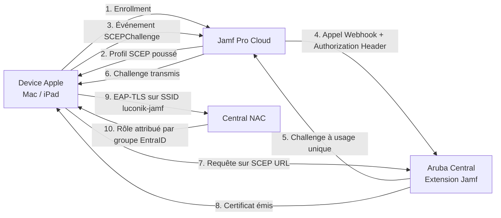

## Prérequis

- Aruba Central NAC — souscription **Central Foundation**
- Identity store EntraID déjà configuré dans Central (App Registration, permissions)
- Jamf Pro Cloud, **version 10.32 ou supérieure** (lab validé en `11.31.1-t1787060595569`)
- Compte Jamf Pro avec droits d'administration pour créer un rôle/client API (voir repo [`jamf-pro/eap-tls`](https://github.com/Luconik/hpe-aruba-guides/tree/main/jamf-pro/eap-tls) pour les privilèges API exacts)
- Groupes EntraID existants pour le mapping de rôles NAC

> ⚠️ **Piège — secret Entra référencé à deux endroits.** Le secret client Entra est utilisé à la fois dans l'extension MDM Jamf et dans l'identity store Central. Le régénérer dans Entra invalide les deux références simultanément — il faut le mettre à jour aux deux endroits après régénération.
>
> ⚠️ **Piège — Value vs Secret ID.** Côté Entra, lors de la création du secret, c'est la **Value** qu'il faut copier, pas le **Secret ID**. Une erreur fréquente qui casse silencieusement l'authentification de l'extension.

## Partie 1 — Aruba Central : Extension Jamf

### 1.1 Installer l'extension Jamf

1. Dans Aruba Central, ouvrir **Global** → **Maintenance** → **Extensions** (onglet **Available Extensions**).
2. Dans le catalogue, repérer l'extension **Jamf** — elle existe nativement, au même titre que l'extension Intune.

   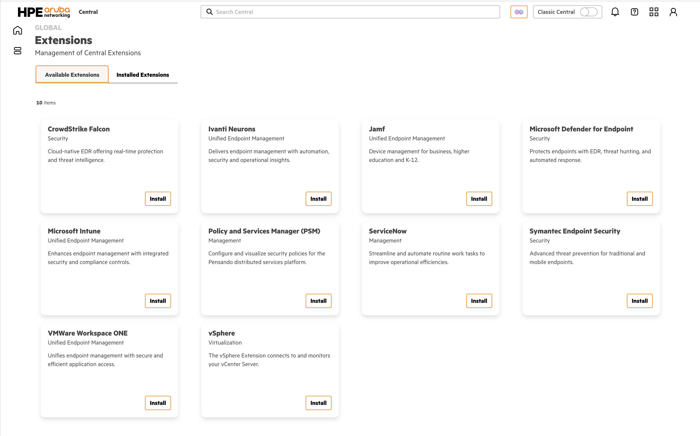

3. Cliquer sur **Install** sur la carte Jamf.

### 1.2 Configurer l'extension

Le formulaire d'installation sert aussi de formulaire de configuration — il n'y a pas d'étape de nommage séparée de la configuration des identifiants.

1. Donner un nom à l'instance (ex. `<nom-instance-jamf>`) et laisser le type sur **Jamf Pro**.
2. Renseigner l'**URL** de l'instance Jamf Pro : `<tenant-jamf>.jamfcloud.com`.
3. Dans **Connect Using**, sélectionner **OAuth**.
4. Renseigner le **Client ID** et le **Secret** de l'App Registration Entra ID créée pour cette intégration, ainsi que le **Token Server URL** (`https://<tenant-jamf>.jamfcloud.com/api/oauth/token`).

   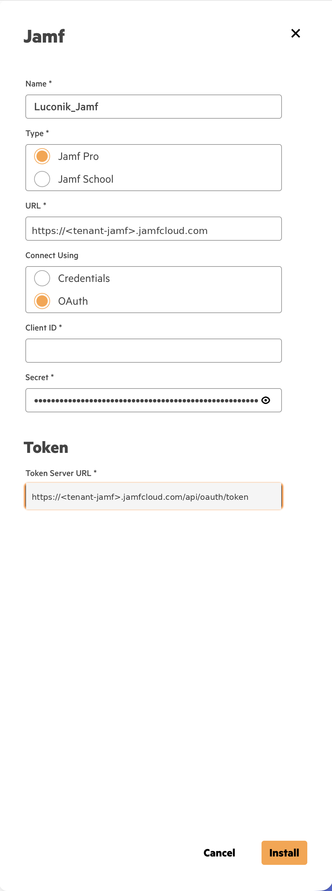

5. Cliquer sur **Install** — l'instance apparaît dans l'onglet **Installed Extensions** au statut **Active**.

   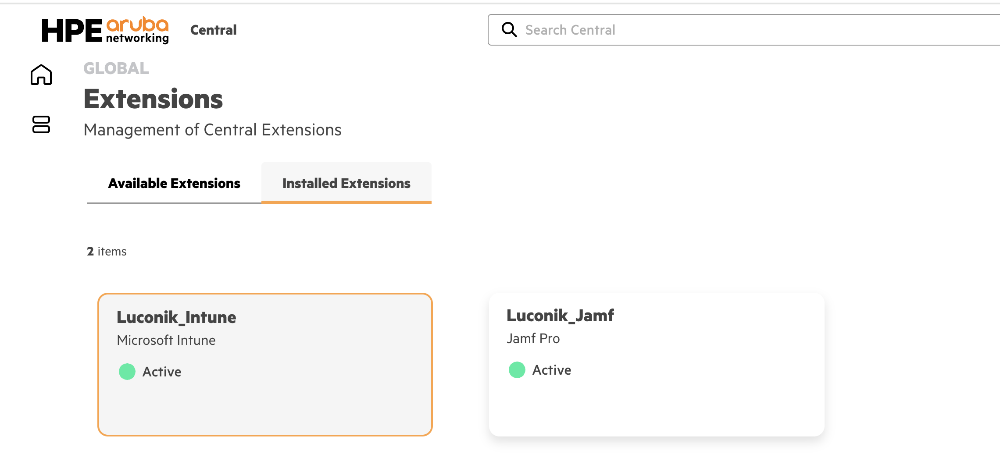

> ⚠️ **Piège — pas de champ « Extension ».** Contrairement à l'extension Intune, l'écran de configuration de l'instance UEM Jamf ne présente pas de champ *Extension* pour un lien applicatif direct. L'intégration repose entièrement sur le mécanisme SCEP URL + SCEP Challenge Webhook URL + Authorization Header décrit ci-dessous — c'est ce triptyque qu'il faut transmettre côté Jamf Pro.

### 1.3 Récupérer SCEP URL, Webhook URL et Authorization Header

1. Une fois l'instance connectée, ouvrir l'onglet exposant les informations SCEP de l'instance.
2. Relever et copier les trois valeurs suivantes, à transmettre à la configuration PKI de Jamf Pro (voir repo [`jamf-pro/eap-tls`](https://github.com/Luconik/hpe-aruba-guides/tree/main/jamf-pro/eap-tls), Partie 1.1) :
   - **SCEP URL** — endpoint sur lequel le device va récupérer son certificat
   - **SCEP Challenge Webhook URL** — endpoint que Jamf appelle sur l'événement `SCEPChallenge`
   - **Authorization Header** — header d'authentification à configurer côté Jamf pour l'appel webhook

   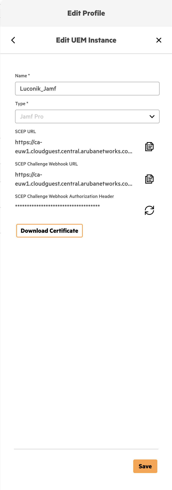

3. Conserver ces trois valeurs de côté.

> ℹ️ **Note.** Ces trois valeurs sont saisies une seule fois côté Jamf Pro (payload SCEP) et l'Authorization Header n'est pas réaffiché en clair par la suite — le noter avant de quitter l'écran.

**Mécanisme (cœur de l'intégration) :** Jamf appelle le Webhook sur l'événement `SCEPChallenge` avec l'Authorization Header ; Central renvoie un challenge à usage unique ; le device utilise ce challenge pour obtenir son certificat sur l'URL SCEP. Voir le diagramme en [Overview](#overview).

## Partie 2 — Configuration Aruba Central NAC

### 2.1 Configurer l'identity store OAuth EntraID

1. Ouvrir **Central NAC** → **Configuration** → **Identity Management**.
2. La liste affiche les identity stores existants (ex. `Luconik_EntraID`, `Luconik_Visitor`, `MAC Address Store`, `Wi-Fi Easy Connect Registration Store`) avec, pour chacun, les Authentication Profiles et Authorization Policies qui le référencent.
3. Sélectionner l'identity store **OAuth 2.0 EntraID** déjà configuré et utilisé pour l'extension Jamf (Partie 1.2) — un seul identity store sert les deux besoins.
4. Vérifier que le Tenant ID et l'App Registration correspondent bien à ceux utilisés côté extension.

   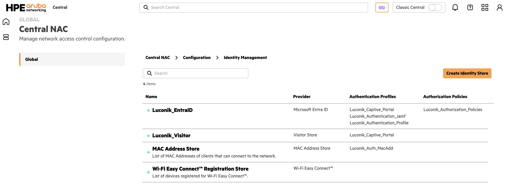

### 2.2 Créer les rôles NAC

1. Ouvrir **Global** → **Configuration Overview** → **Library** → onglet **Roles & Policies** → **Roles**. Ce référentiel de rôles est partagé par l'ensemble de Central (pas propre à Central NAC).
2. Créer un rôle par population cible, ex. `Luconik`, destiné à être mappé sur un groupe EntraID (voir 2.5) — assigné aux device functions concernées (Campus Access Point, Access Switch, Mobility Gateway…) sur le scope du site (ex. `Homelab`).
3. Définir les droits réseau associés (VLAN, ACL, etc.) selon la politique du site.

   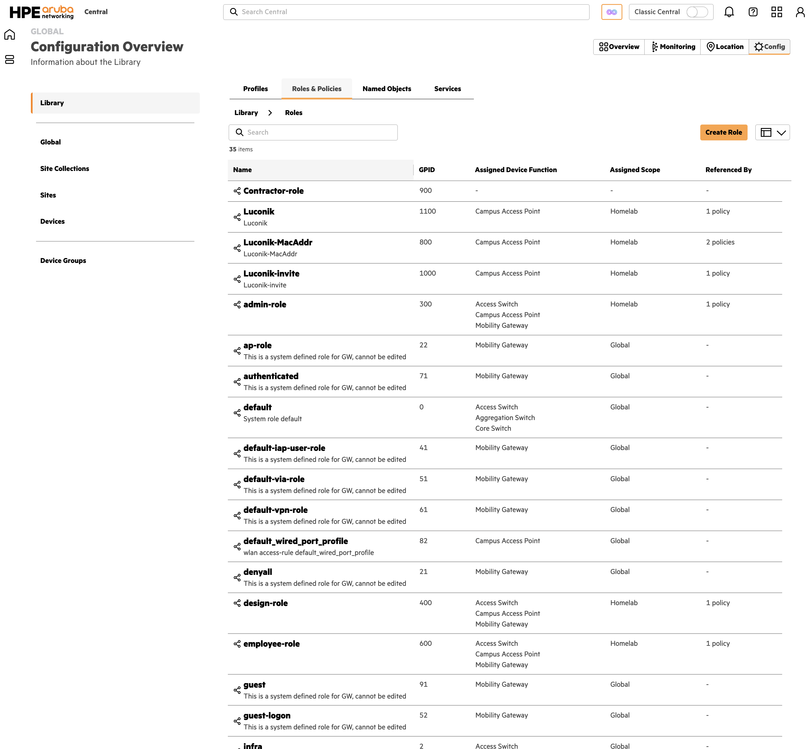

### 2.3 Configurer la policy NAC globale

1. Ouvrir **Global** → **Configuration Overview** → **Library** → onglet **Roles & Policies** → **Security Policies** → **Role-based Policies**. Comme pour les rôles (2.2), c'est un référentiel partagé par l'ensemble de Central, pas propre à Central NAC.
2. Créer (ou éditer) une policy de type Role-based (ex. `XYZ-policies`), assignée aux device functions concernées (Access Switch, Campus Access Point, Mobility Gateway…) sur le scope du site (ex. `Homelab`).
3. Ajouter une règle par rôle créé en 2.2 : **Source** = `Access Role` → sélectionner le rôle (ex. `admin-role`), **Destination** = `Any` (ou plus restrictif selon la segmentation voulue), **Service/Application** = `Any`, **Action** = `Allow`.

   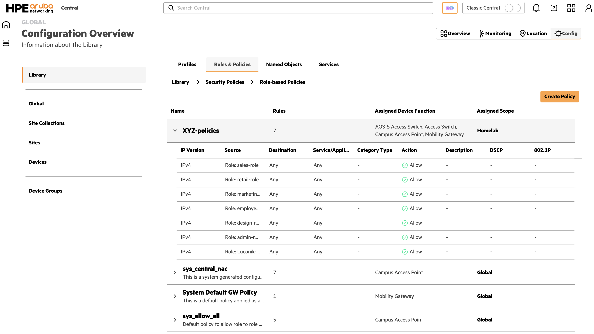

   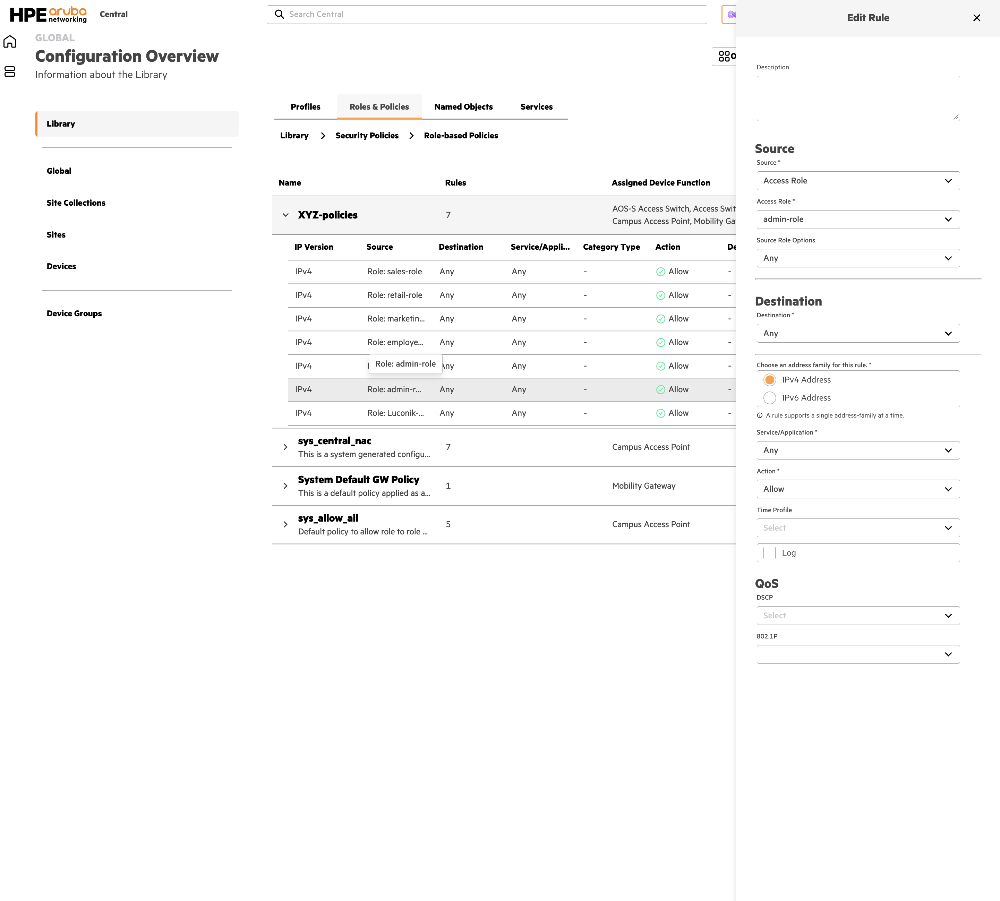

4. Répéter pour chaque rôle nécessitant un accès réseau (une règle = un rôle). C'est cette policy qui matérialise, au niveau réseau, les droits associés à chaque rôle NAC.

   > ℹ️ Des policies système en lecture seule existent également (`sys_central_nac`, `System Default GW Policy`, `sys_allow_all`, scope `Global`) — ne pas les modifier, elles sont gérées par Central.

### 2.4 Créer le profil SSID 802.1X

1. Ouvrir le profil WLAN du SSID `luconik-jamf` (configuration du site/AP group concerné) → section **Security**.
2. Security Level : **Enterprise**.
3. Key Management : **WPA3-Enterprise (CCM 128)**.
4. Authentication → Server Group : **Central NAC**.

   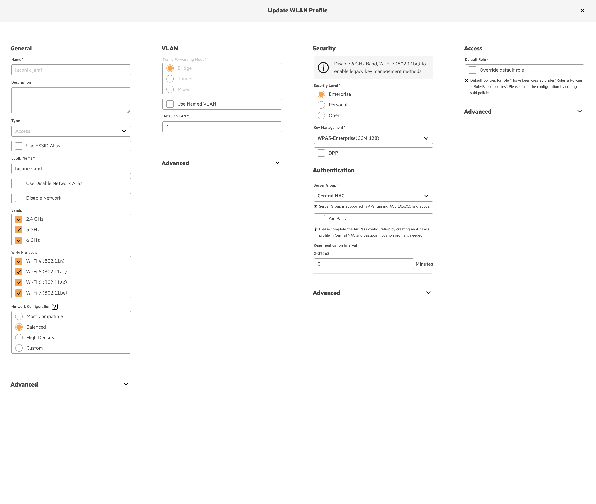

5. Déployer le profil sur le(s) AP group(s) concerné(s).

### 2.5 Créer la policy d'autorisation

1. Ouvrir **Central NAC** → **Configuration** → **Authorization Policies**.
2. Une policy regroupe plusieurs **règles** ordonnées, chacune évaluée dans l'ordre (la première qui matche s'applique, la dernière étant un `Deny All` par défaut).
3. Créer une règle dont la condition matche le groupe EntraID `<nom-du-groupe>`, avec pour action **Allow** et le rôle NAC créé en 2.2.
4. Positionner la règle dans l'ordre voulu par rapport aux autres règles existantes.

   

### 2.6 Créer le profil d'authentification EAP-TLS

1. Ouvrir **Central NAC** → **Configuration** → **Authentication Profiles**.
2. Créer un profil de type **EAP-TLS**.
3. Associer l'instance UEM Jamf (Partie 1) comme source de validation du certificat client.
4. Associer ce profil au SSID `luconik-jamf` créé en 2.4.

   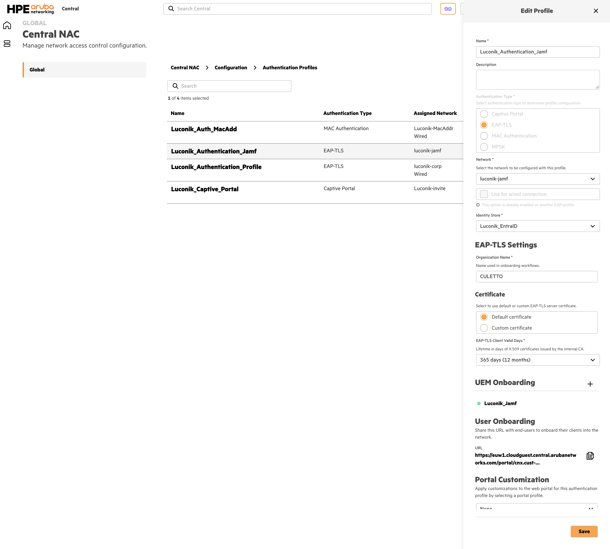

## Partie 3 — Validation

Une fois la configuration Jamf Pro terminée côté device (voir repo [`jamf-pro/eap-tls`](https://github.com/Luconik/hpe-aruba-guides/tree/main/jamf-pro/eap-tls)) :

1. Ouvrir **Central NAC** → **Monitoring** → **Clients**.
2. Filtrer sur le MacBook Pro M1 puis sur l'iPad Pro 11 testés.
3. Vérifier pour chacun :
   - Authentification EAP-TLS acceptée
   - Rôle attribué conformément à la règle d'appartenance au groupe EntraID (2.5)
   - Session NAC démarrée

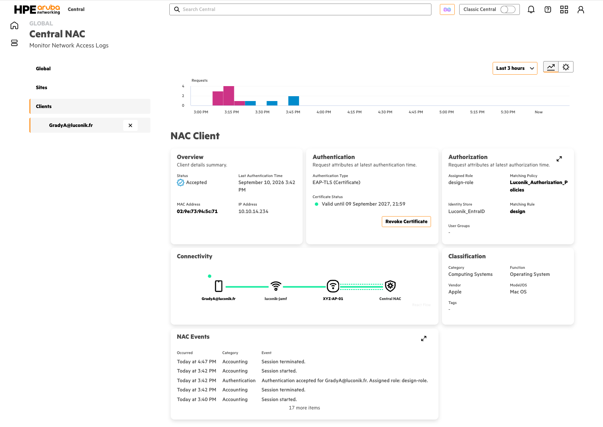

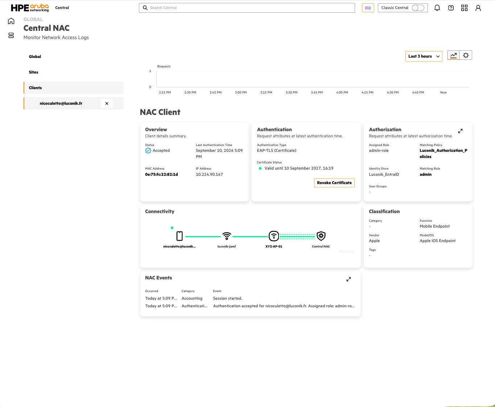

> 🔍 **Anomalie observée (à remonter à HPE).** Le champ **User Groups** de la vue NAC Client reste vide avec le profil Jamf, alors qu'il est correctement renseigné avec le profil Intune — même compte, même identity store, profils d'authentification identiques champ par champ. La règle d'autorisation matche néanmoins correctement et le rôle attendu est bien attribué : l'anomalie est d'affichage, pas fonctionnelle. Non bloquant, mais à signaler pour investigation.

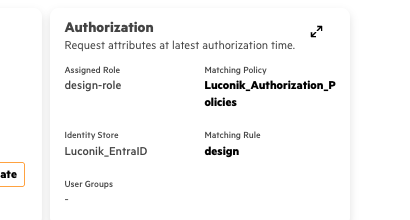

## Références

- Repo compagnon — configuration Jamf Pro et enrôlement des devices : [`Luconik/hpe-aruba-guides/jamf-pro`](https://github.com/Luconik/hpe-aruba-guides/tree/main/jamf-pro/eap-tls)
- Technote HPE TechDocs — Central NAC + Microsoft Intune (référence pour la structure de ce document)
- [Aruba Central NAC — Configuring EAP-TLS Profile](https://arubanetworking.hpe.com/techdocs/new-central/content/nac/config-eap.htm)
- [Onboarding with Intune | TechDocs - NAC](https://arubanetworking.hpe.com/techdocs/NAC/central-nac/central-nac-uem-onboarding-intune/)

## File structure

> Les captures `01`, `03`, `04`, `09`, `10`, `12` et `13` sont réutilisées telles quelles par le repo compagnon [`jamf-pro/eap-tls`](https://github.com/Luconik/hpe-aruba-guides/tree/main/jamf-pro/eap-tls) — elles sont dupliquées dans son propre dossier `screenshots/`.

```
central-nac-jamf/
├── README.md              (ce document, FR)
├── README-EN.md            (version EN)
└── screenshots/
    ├── 01-central-extensions-catalog.png
    ├── 02-central-extension-jamf-install.png
    ├── 03-central-extension-jamf-config.png
    ├── 04-central-scep-webhook-header.png
    ├── 05-central-nac-identity-store.png
    ├── 06-central-nac-roles.png
    ├── 07-central-nac-global-policy.png
    ├── 07b-central-nac-global-policy-rule.png
    ├── 08-central-nac-ssid-profile.png
    ├── 09-central-nac-authorization-policy.png
    ├── 10-central-nac-eap-tls-profile.png
    ├── 12-nac-client-session-mac.png
    ├── 13-nac-client-session-ipad.png
    └── 14-nac-client-user-groups-anomaly.png
```
