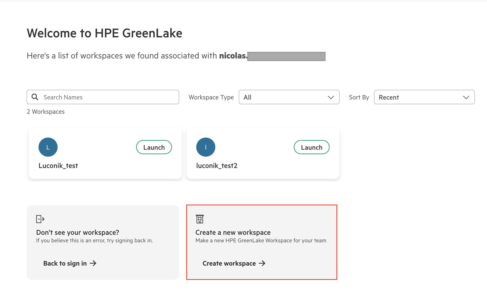
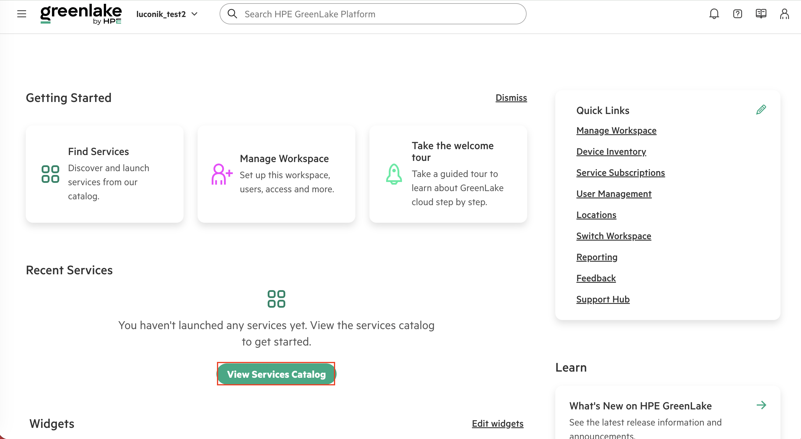
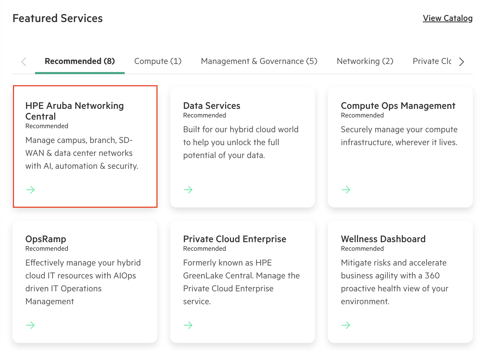
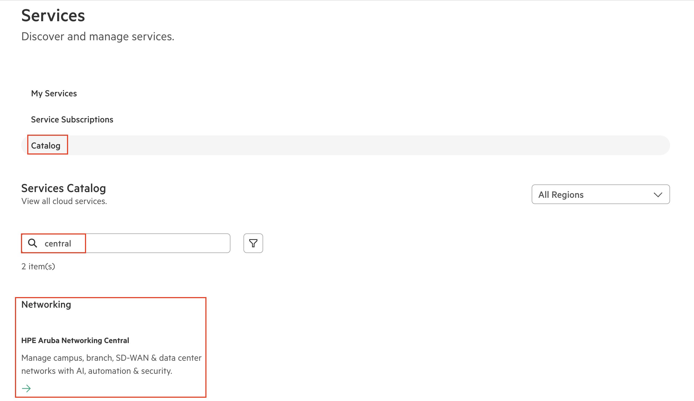
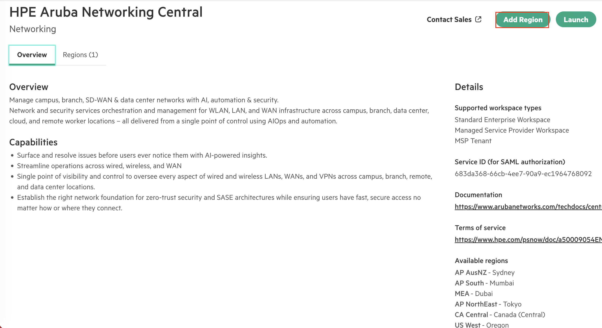
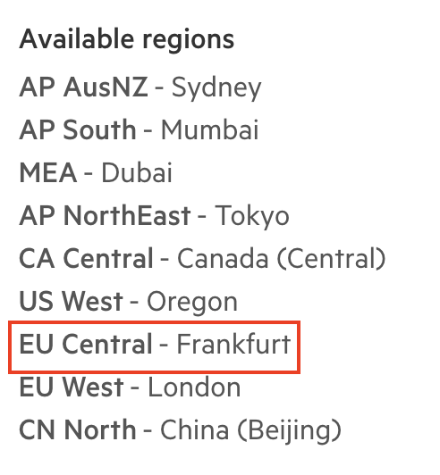

# HPE GreenLake — Workspace & Aruba Central
# HPE GreenLake — Workspace & Aruba Central

> 🇫🇷 [Français](#fr) | 🇬🇧 [English](#en)

---

<a name="fr"></a>
## 🇫🇷 Français

### Objectif

Ce guide explique comment créer un **workspace HPE GreenLake** et déployer le service **HPE Aruba Networking Central** en sélectionnant une région de déploiement.

> 📋 Prérequis : disposer d'un compte HPE NSP actif — voir [`../nsp-account/`](../nsp-account/)

---

### Étape 1 — Accéder à HPE GreenLake

1. Aller sur [https://common.cloud.hpe.com](https://common.cloud.hpe.com)
2. Se connecter avec le compte NSP créé précédemment

La page d'accueil liste les workspaces existants associés au compte.  
Cliquer sur **"Create workspace →"** pour en créer un nouveau.



> 💡 Un même compte peut avoir plusieurs workspaces (ex. un par environnement : test, prod, homelab).

---

### Étape 2 — Dashboard du workspace

Une fois le workspace créé et sélectionné, le dashboard principal s'affiche avec :
- **Find Services** — accès au catalogue de services
- **Manage Workspace** — gestion des utilisateurs et accès
- **Quick Links** — raccourcis vers les sections principales

Cliquer sur **"View Services Catalog"** pour ajouter des services.



---

### Étape 3 — Trouver le service Aruba Central

Deux méthodes pour trouver le service :

**Méthode A — Via les Featured Services**  
Sur le dashboard, les services recommandés apparaissent directement.  
Cliquer sur **"HPE Aruba Networking Central"**.



**Méthode B — Via le catalogue**  
Aller dans **Services → Catalog**, rechercher **"central"** dans la barre de recherche.  
Cliquer sur la tuile **"HPE Aruba Networking Central"** (catégorie Networking).



---

### Étape 4 — Ajouter une région

Sur la fiche du service, cliquer sur **"Add Region"**.



---

### Étape 5 — Sélectionner la région

Dans la liste des régions disponibles, sélectionner la région souhaitée.  
Pour un déploiement en Europe, choisir **EU Central - Frankfurt**.



> 🌍 **Régions disponibles pour Aruba Central :**
>
> | Région | Datacenter |
> |--------|-----------|
> | AP AusNZ | Sydney |
> | AP South | Mumbai |
> | MEA | Dubai |
> | AP NorthEast | Tokyo |
> | CA Central | Canada (Central) |
> | US West | Oregon |
> | **EU Central** | **Frankfurt** ← recommandé Europe |
> | EU West | London |
> | CN North | Beijing |

---

### Étape 6 — Lancer le service

Une fois la région ajoutée, cliquer sur **"Launch"** pour accéder au dashboard Aruba Central.

---

### Notes importantes

> 💡 Pour un homelab, choisir le type de workspace **Standard Enterprise Workspace**.

> 💡 Le **Service ID (SAML)** visible sur la fiche du service est utilisé pour la configuration SSO — voir [`../greenlake-sso/`](../greenlake-sso/).

> 💡 Types de workspace supportés par Aruba Central : Standard Enterprise Workspace, Managed Service Provider Workspace, MSP Tenant.

---

### Étapes suivantes

👉 Configurer le SSO GreenLake : [`../greenlake-sso/`](../greenlake-sso/)  
👉 Intégration NAC + Intune : [`../central-nac-intune/`](../central-nac-intune/)

---
---

<a name="en"></a>
## 🇬🇧 English

### Purpose

This guide explains how to create an **HPE GreenLake workspace** and deploy the **HPE Aruba Networking Central** service by selecting a deployment region.

> 📋 Prerequisite: an active HPE NSP account — see [`../nsp-account/`](../nsp-account/)

---

### Step 1 — Access HPE GreenLake

Go to [https://common.cloud.hpe.com](https://common.cloud.hpe.com) and sign in with your NSP account.  
Click **"Create workspace →"** to create a new workspace.


---

### Step 2 — Workspace dashboard

Once inside the workspace, click **"View Services Catalog"** to add services.


---

### Step 3 — Find Aruba Central

**Method A — Featured Services**  
Click **"HPE Aruba Networking Central"** from the recommended services.


**Method B — Catalog search**  
Go to **Services → Catalog**, search **"central"**, click the **"HPE Aruba Networking Central"** tile.


---

### Step 4 — Add a region

On the service page, click **"Add Region"**.


---

### Step 5 — Select region

Select **EU Central - Frankfurt** for European deployments.


---

### Step 6 — Launch

Once the region is added, click **"Launch"** to open the Aruba Central dashboard.

---

### Key notes

> 💡 For a homelab, select **Standard Enterprise Workspace** type.

> 💡 The **Service ID (SAML)** on the service page is needed for SSO setup — see [`../greenlake-sso/`](../greenlake-sso/).

---

### Next steps

👉 Configure GreenLake SSO: [`../greenlake-sso/`](../greenlake-sso/)  
👉 NAC + Intune integration: [`../central-nac-intune/`](../central-nac-intune/)

---

## File structure / Structure des fichiers

```
greenlake-workspace/
├── README.md                                       ← This file / Ce fichier
└── screenshots/
    ├── HPE_GreenLake_Workspace_Creation.png
    ├── HPE_GreenLake_View_Services_Catalogue.png
    ├── HPE_GreenLake_Select_Central_Service.png
    ├── HPE_GreenLake_Find_Central_Service.png
    ├── HPE_GreenLake_Service_Add_Region.png
    ├── HPE_GreenLake_Select_Service_Region.png
    └── HPE_GreenLake_Select_Service_Region_EU.png
```

---

*Last updated: March 2026 — [@Luconik](https://github.com/Luconik)*
