# Onboarding d’appareils Jamf Pro avec Aruba Central NAC

> Adaptation Jamf Pro de la technote HPE Aruba Networking [Onboarding with Intune](https://arubanetworking.hpe.com/techdocs/NAC/central-nac/central-nac-uem-onboarding-intune/). Elle décrit l’utilisation de **Central NAC UEM Onboarding** et de sa PKI intégrée pour émettre des certificats EAP-TLS à des terminaux Apple gérés par Jamf Pro.
>
> Cette intégration n'est documentée nulle part ailleurs à ce jour, ni chez HPE ni chez Jamf. Le repo compagnon [`central-nac-jamf`](https://github.com/Luconik/hpe-aruba-guides/tree/main/central-nac-jamf) couvre le détail de la configuration côté Aruba Central ; ce document se concentre sur la configuration côté Jamf Pro et l'onboarding des terminaux.

## Sommaire

- [Vue d’ensemble](#vue-densemble)
- [Pré-requis](#pré-requis)
- [Configuration de l’intégration UEM Jamf Pro](#configuration-de-lintégration-uem-jamf-pro)
  - [Configurer Entra ID et l’extension Jamf dans Central](#configurer-entra-id-et-lextension-jamf-dans-central)
  - [Créer le rôle et le client API Jamf](#créer-le-rôle-et-le-client-api-jamf)
  - [Configurer le WLAN et le profil d’authentification Central NAC](#configurer-le-wlan-et-le-profil-dauthentification-central-nac)
- [Configuration Jamf Pro](#configuration-jamf-pro)
  - [Pré-requis d'enrôlement — User-initiated enrollment](#pré-requis-denrôlement--user-initiated-enrollment)
  - [Créer le profil de configuration (Certificate + SCEP + Network)](#créer-le-profil-de-configuration-certificate--scep--network)
  - [Déployer le profil](#déployer-le-profil)
- [Validation](#validation)
- [Références](#références)
- [File structure](#file-structure)

## Vue d’ensemble

Aruba Central NAC peut utiliser une plateforme UEM pour distribuer les profils nécessaires aux terminaux tout en conservant l’émission des certificats dans la PKI Central NAC. Côté Jamf, tout tient dans **un seul profil de configuration** combinant trois payloads : **Certificate** (le certificat racine Central NAC, pour que le terminal fasse confiance au certificat qui sera émis), **SCEP** (pointant directement vers l’URL SCEP exposée par l’extension Jamf de Central) et **Network** (le Wi-Fi 802.1X, qui consomme l’identité émise par le payload SCEP).

1. Jamf Pro distribue ce profil (Certificate + SCEP + Network) aux appareils gérés.
2. Au moment de l’installation du profil, l’agent Jamf effectue la demande SCEP auprès de l’URL Central NAC — l’échange de challenge avec l’extension Jamf de Central se fait côté serveur, sans champ à renseigner manuellement dans Jamf.
3. Central NAC émet le certificat client via son URL SCEP.
4. Le terminal se connecte au SSID 802.1X avec ce certificat en EAP-TLS.
5. Central NAC attribue le rôle réseau à partir de l’identité Entra ID et de la policy d’autorisation.

> ℹ️ **Correction par rapport à la technote Intune.** Il n'existe pas d'objet « PKI proxy server » séparé à créer dans Jamf Pro pour cette intégration — contrairement à ce que le nom pourrait laisser penser par analogie avec Intune. Le payload SCEP du profil de configuration pointe directement sur l'URL SCEP fournie par l'extension Jamf de Central, en **Manual configuration**.

> Le diagramme détaillé du flux (10 étapes) est dans le repo compagnon [`central-nac-jamf`](https://github.com/Luconik/hpe-aruba-guides/tree/main/central-nac-jamf#overview).

Cette intégration a été validée avec :

| Composant | Valeur de référence |
|---|---|
| Central NAC | Central Foundation |
| UEM | Jamf Pro Cloud 11.32 |
| Identity provider | Microsoft Entra ID |
| SSID | `luconik-jamf` |
| Sécurité Wi-Fi | WPA3-Enterprise (CCMP-128), EAP-TLS |
| Terminaux de validation | MacBook Pro M1 et iPad Pro 11 |

## Pré-requis

- Une extension **Jamf Pro** active dans Aruba Central et un identity store Entra ID associé.
- Un SSID 802.1X associé au groupe de serveurs **Central NAC**.
- Les trois valeurs de l’extension Jamf Central : **SCEP URL**, **SCEP Challenge Webhook URL** et **Authorization Header**.
- Un compte Jamf Pro autorisé à créer des API roles/clients et des profils de configuration (payloads Certificate, SCEP, Network).
- Des groupes Entra ID permettant le mapping des rôles Central NAC.

> Les valeurs spécifiques au tenant Jamf ne sont jamais reprises dans ce document. Utiliser `<tenant-jamf>.jamfcloud.com` dans les exemples et les captures publiques.

## Configuration de l’intégration UEM Jamf Pro

La configuration se répartit entre Aruba Central, qui fournit la PKI et les politiques NAC, et Jamf Pro, qui distribue les profils Apple et vérifie le challenge SCEP.

### Configurer Entra ID et l’extension Jamf dans Central

1. Dans Central, ouvrir **Menu > Extensions**.
2. Créer ou ouvrir l’instance **Jamf Pro**.
3. Renseigner l’URL de l’instance Jamf sous la forme `<tenant-jamf>.jamfcloud.com`.
4. Sélectionner l’identity store OAuth 2.0 Entra ID puis renseigner Tenant ID, Client ID et Client Secret.
5. Enregistrer et vérifier que l’extension est **Active**.


L’extension expose ensuite les trois valeurs (SCEP URL, SCEP Challenge Webhook URL, Authorization Header) à reporter dans le payload SCEP du profil de configuration Jamf. L’Authorization Header n’est pas réaffiché en clair : le stocker dans un gestionnaire de secrets avant de quitter l’écran.


### Créer le rôle et le client API Jamf

L’extension Jamf consulte l’inventaire Jamf pour lier le terminal au flux UEM Onboarding. Utiliser un rôle dédié, en lecture seule, plutôt qu’un compte administrateur générique.

1. Dans Jamf Pro, ouvrir **Settings > System > API roles and clients > API Roles**.
2. Créer le rôle `<central-nac-read-only>` avec uniquement les privilèges suivants :

| Privilège | Usage |
|---|---|
| Read Computers | Lecture des Mac enrôlés |
| Read Mobile Devices | Lecture des iPad/iPhone enrôlés |
| Read Smart Computer Groups | Lecture des groupes dynamiques macOS |
| Read Smart Mobile Device Groups | Lecture des groupes dynamiques iOS/iPadOS |

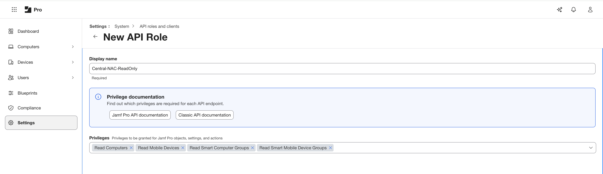

3. Dans **API Clients**, créer un client associé à ce rôle, l’activer et conserver son secret.
4. Régler **Access token lifetime** sur **900 secondes**.

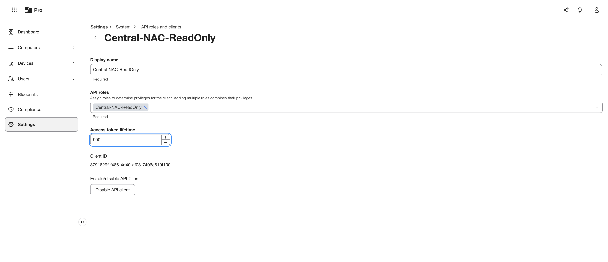

> La valeur par défaut de 60 secondes est trop courte pour un flux SCEP fiable. La création ou la rotation d’un secret doit être traitée comme une opération sensible : le secret n’est affiché qu’une seule fois.

### Configurer le WLAN et le profil d’authentification Central NAC

Créer ou vérifier le réseau 802.1X avant de créer le profil d’authentification.

1. Créer le SSID `luconik-jamf` dans la bibliothèque de configuration Central.
2. Utiliser **WPA3-Enterprise (CCMP-128)** et sélectionner **Central NAC** comme serveur d’authentification.
3. Dans **Menu > Central NAC > Configuration > Authentication Profiles**, créer un profil de type **EAP-TLS**.
4. Associer le SSID, l’identity store Entra ID et l’extension Jamf dans **UEM Onboarding**.
5. Créer une policy d’autorisation qui mappe les groupes Entra ID aux rôles NAC attendus.


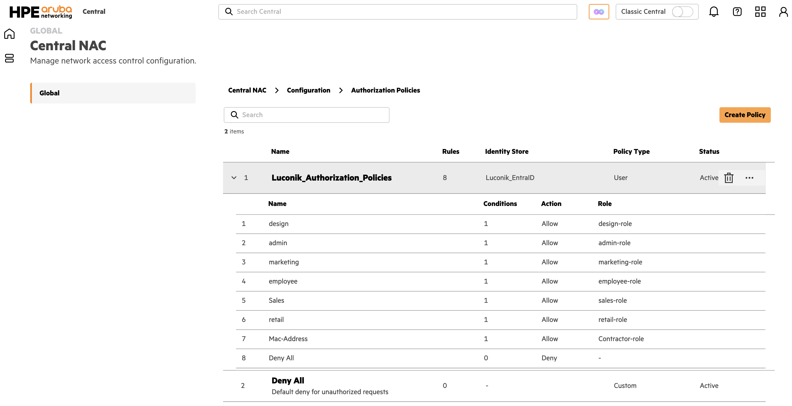

## Configuration Jamf Pro

Tout se fait dans **un seul profil de configuration** macOS (répéter le même principe pour iOS/iPadOS si les deux plateformes sont gérées), combinant trois payloads : **Certificate**, **SCEP** et **Network**.

### Pré-requis d'enrôlement — User-initiated enrollment

Avant de pouvoir pousser le profil de configuration, les terminaux doivent déjà être enrôlés comme appareils gérés dans Jamf Pro. Ce document ne couvre pas le choix de méthode d'enrôlement (PreStage vs auto-enrôlement) mais documente la configuration observée dans le lab, sous **Settings > Global > User-initiated enrollment** :

1. **General** : `Skip certificate installation during enrollment` coché (un certificat SSL interne/tiers de confiance est déjà en place sur l'instance, l'étape d'installation de certificat pendant l'enrôlement est donc sautée) ; `Restrict re-enrollment to authorized users only` et `Use a third-party signing certificate` décochés.

   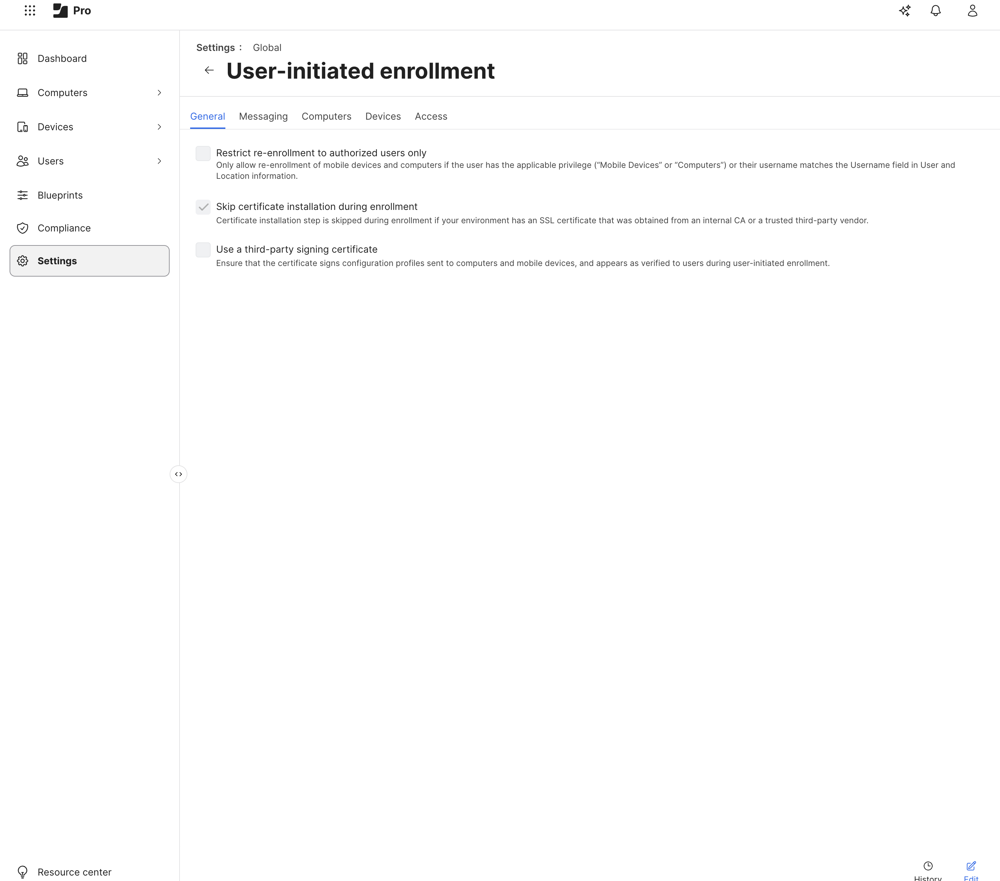

2. **Messaging** : message d'enrôlement en anglais par défaut (`Enroll Your Device`) — à adapter/traduire si besoin.

   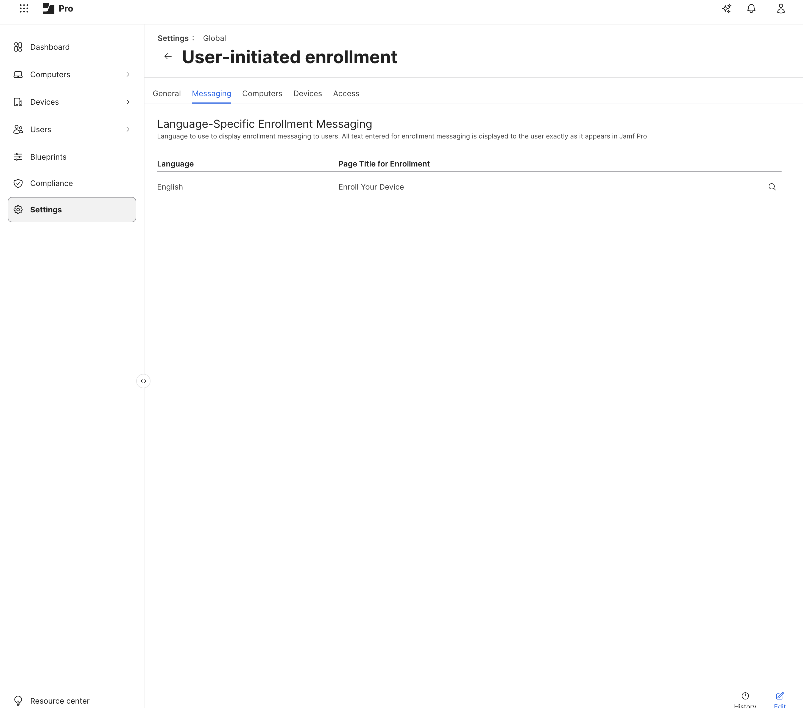

3. **Computers** : `Enable user-initiated enrollment for computers` coché (URL d'enrôlement `https://<tenant-jamf>.jamfcloud.com/enroll`). Compte admin managé, SSH forcé et lancement de Self Service laissés désactivés dans le lab.

   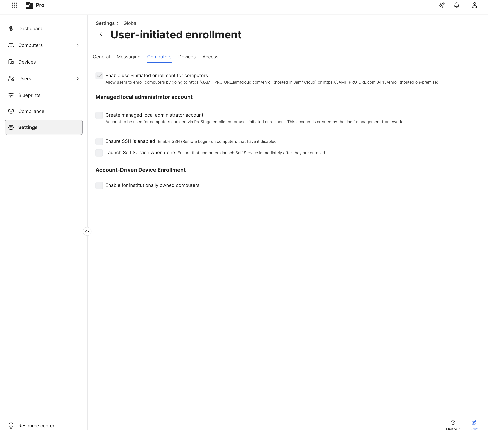

4. **Devices** : `Enable for institutionally owned devices` coché sous **Profile-Driven Enrollment via URL** (mobiles appartenant à l'organisation). Les options **Account-Driven** (enrôlement via Managed Apple ID) ne sont pas utilisées dans ce lab.

   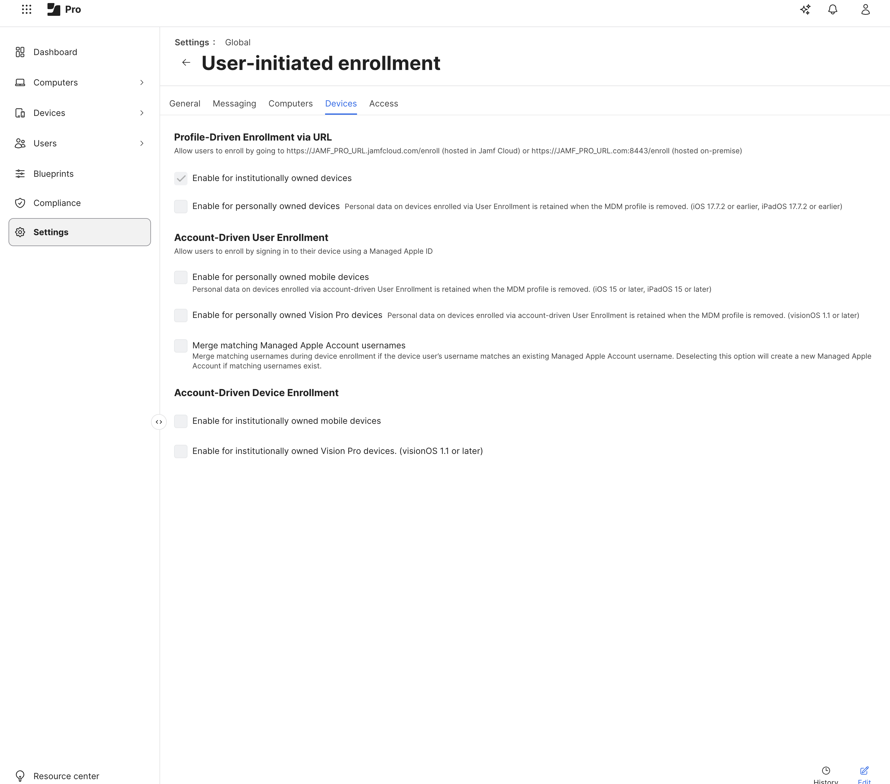

5. **Access** : la table **Directory Service Groups** restreint qui peut s'auto-enrôler, par groupe et par mode (Profile-Driven / Account-Driven). Les groupes utilisés dans le lab ont accès Profile-Driven (Institutional + Personal).

   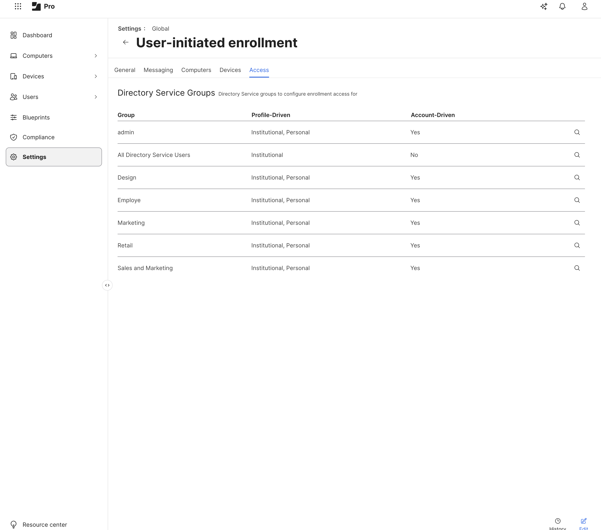

> Cette configuration ne concerne que l'enrôlement MDM initial (obtenir un Mac/iPad géré dans Jamf) — elle est indépendante du flux EAP-TLS décrit dans ce document, qui s'appuie sur le profil de configuration poussé une fois l'appareil déjà enrôlé.

### Créer le profil de configuration (Certificate + SCEP + Network)

1. Ouvrir **Computers > Configuration Profiles** puis créer un profil. Lui donner un nom explicite, ex. `Luconik-CentralNAC-EAPTLS`.

   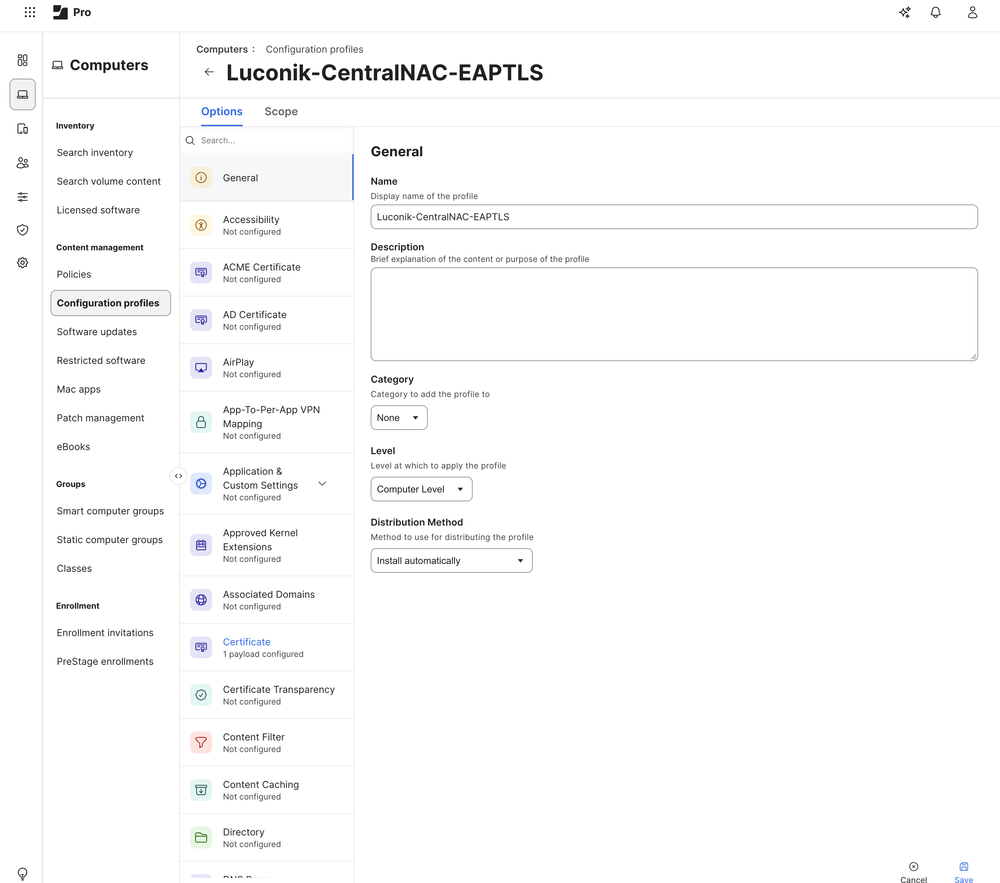

2. Ajouter le payload **Certificate** et y uploader le certificat racine de la PKI Central NAC (`Cloud Authentication Private Root CA (powered by HPE Aruba)`, téléchargeable depuis Central NAC). Lui donner un nom identifiable, ex. `CentralNAC_Certificate` — il sera référencé par le payload Network à l'étape 4.

   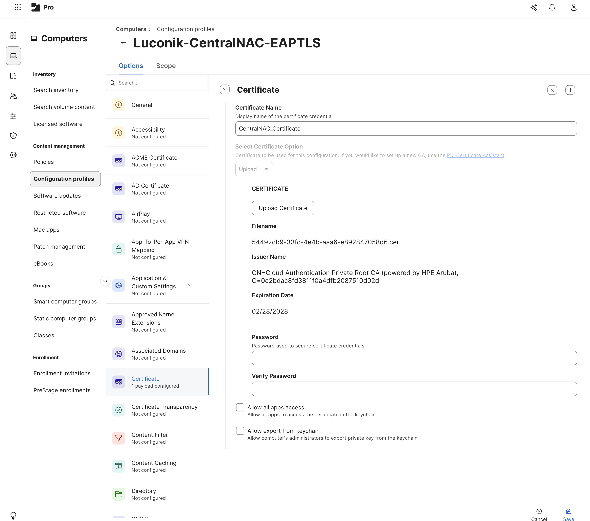

3. Ajouter le payload **SCEP**, avec **Certificate authority type : Manual configuration**, et renseigner :

   | Champ | Valeur |
   |---|---|
   | URL | URL SCEP fournie par l'extension Jamf de Central (Part 1) |
   | Name | identifiant de l'instance, ex. `CentralNAC` |
   | Subject | `CN=$USERNAME` |
   | SAN type | Uniform Resource Identifier |
   | SAN value | `cnac+jamf:///?DeviceId=$JSSID` |
   | Challenge Type | Dynamic |
   | Key Size | 2048 |

   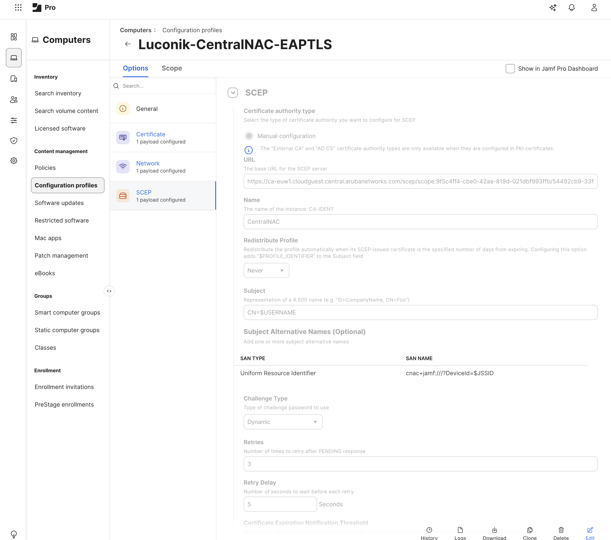

   Le schéma `cnac+jamf://` est spécifique à l'intégration Jamf. Il remplace le schéma `cnac+intune://` de la technote Intune. `$JSSID` est résolu par Jamf avec l'identifiant Jamf de l'appareil ; les séquences Computer et Mobile Device étant distinctes, un Mac et un iPad peuvent tous deux avoir `DeviceId=1`.

   Après émission, vérifier sur le terminal que le certificat contient le SAN suivant :

   ```
   URI:cnac+jamf:///?DeviceId=<id-jamf>
   ```

   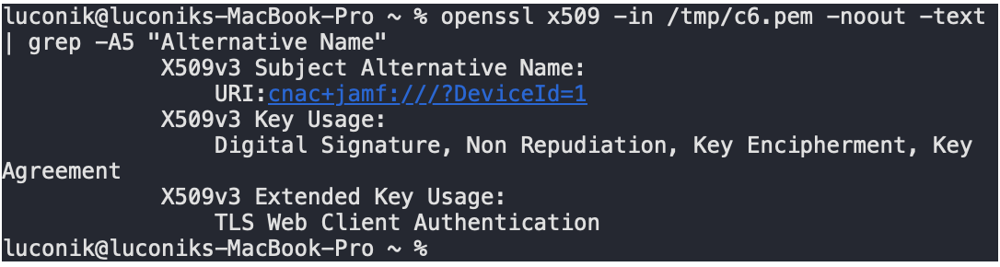

4. Ajouter le payload **Network** :
   - **Network Interface** : Wi-Fi ;
   - **Service Set Identifier (SSID)** : `luconik-jamf` ;
   - **Security Type** : WPA3 Enterprise.

   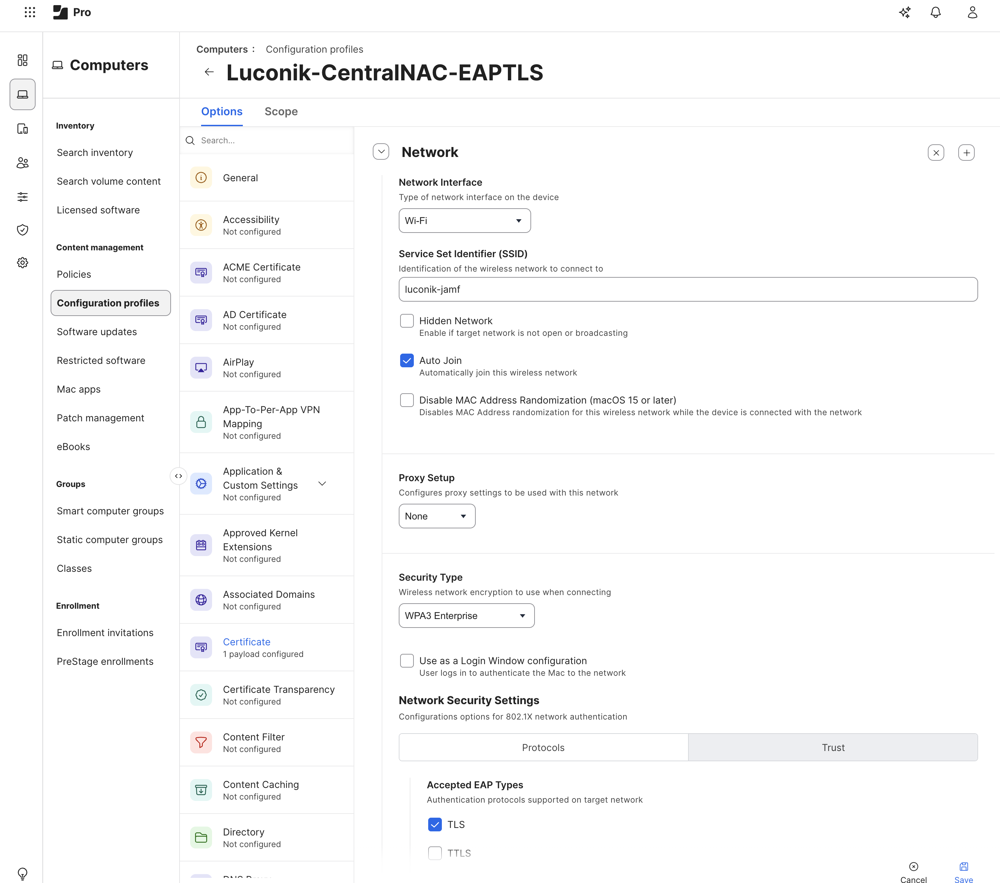

   Dans l'onglet **Protocols**, cocher **TLS** dans Accepted EAP Types. Dans l'onglet **Trust** :
   - **Identity Certificate** : sélectionner le payload SCEP créé à l'étape 3 (il apparaît dans la liste sous la forme `SCEP (<Name>)`) ;
   - **Trusted Certificates** : cocher le certificat racine uploadé à l'étape 2 (`CentralNAC_Certificate`).

   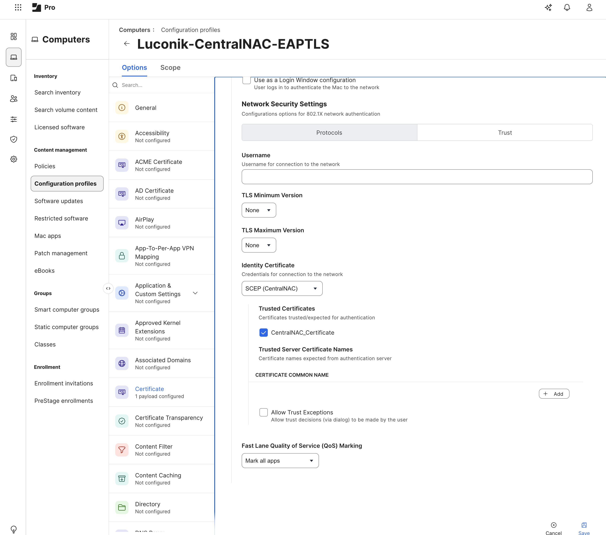

5. Enregistrer le profil.

### Déployer le profil

1. Dans l'onglet **Scope** du profil, affecter les appareils cibles. Un Smart Computer Group / Smart Mobile Device Group est recommandé en production pour un déploiement à l'échelle ; en lab, un ciblage direct sur les appareils spécifiques (**Specific Computers** / **Specific Mobile Devices**) suffit.
2. Enregistrer et attendre le prochain check-in des appareils.

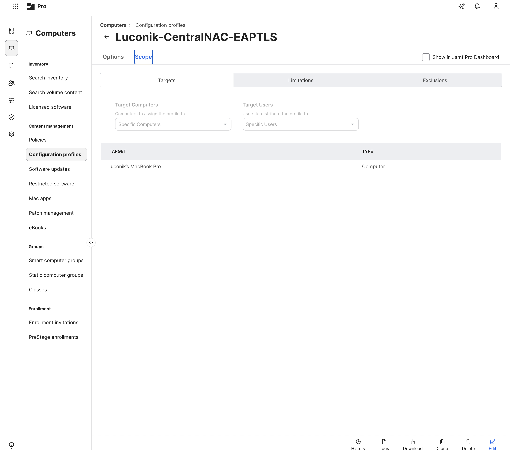

> Un appareil Apple ne peut être enrôlé que dans un seul MDM à la fois. Désenrôler l’appareil d’un MDM précédent avant de l’enrôler dans Jamf Pro.

### iOS/iPadOS : un profil dédié

Le même principe (Certificate + SCEP + Network/Wi-Fi) s'applique à iOS/iPadOS, mais dans un **profil de configuration mobile distinct** — Jamf Pro sépare les profils Computers et Mobile Devices. Dupliquer la convention de nommage avec un suffixe, ex. `Luconik-CentralNAC-EAPTLS-iOS`.

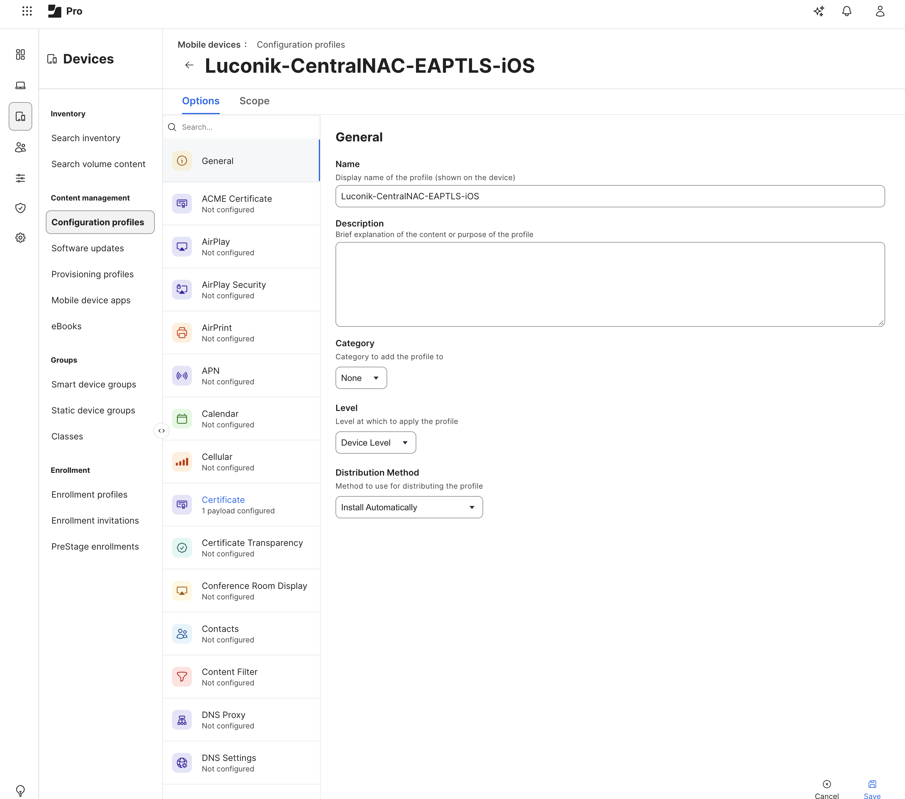

Les payloads Certificate et SCEP sont identiques à la version macOS. Seul le payload **Network** change de nom : sur mobile, il s'agit du payload **Wi-Fi** (au lieu de **Network**), avec un **Security Type** libellé `WPA3 Enterprise (iOS 13 or later)`. Le fonctionnement des onglets **Protocols** / **Trust** (Identity Certificate = le payload SCEP, Trusted Certificates = le certificat racine) reste identique.

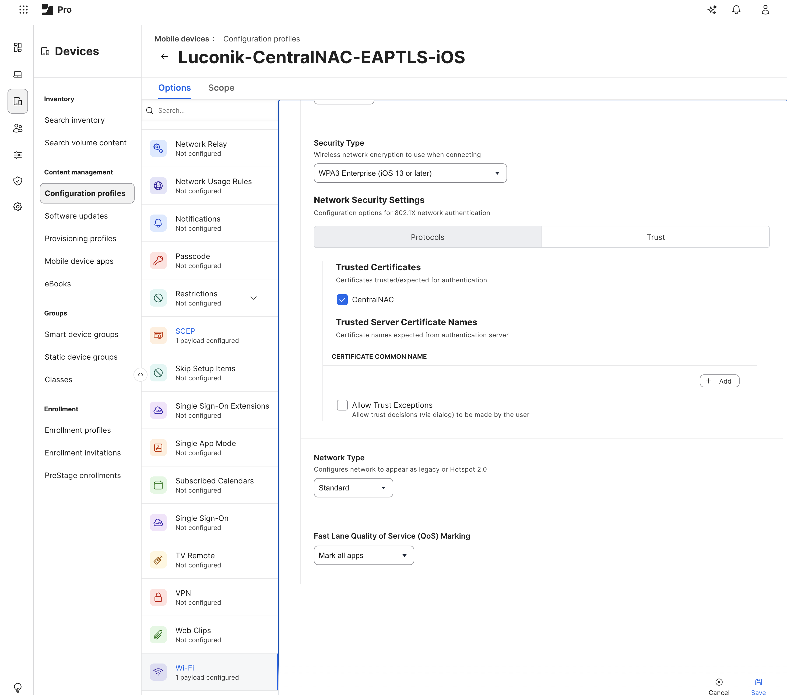

## Validation

1. Dans Jamf Pro, vérifier que le Mac et l’iPad sont gérés et que les profils SCEP et Wi-Fi sont installés. Côté Mac, la vérification peut aussi se faire directement dans **Réglages Système > Général > Gestion des appareils** : le profil `Luconik-CentralNAC-EAPTLS` doit apparaître avec ses 3 payloads (Certificate + SCEP + Network).

   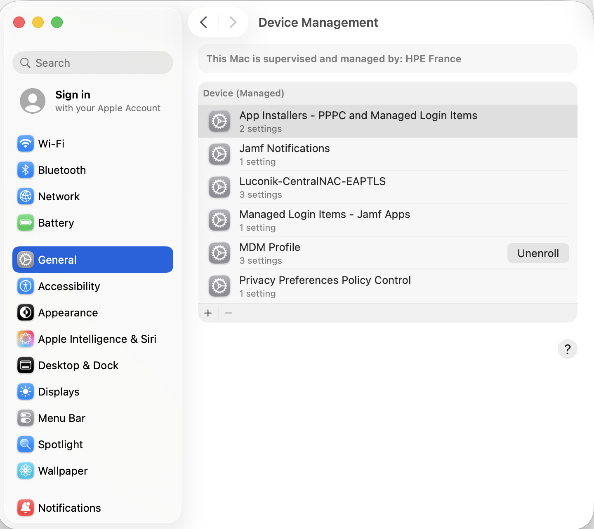

2. Sur le terminal, vérifier le SAN du certificat puis la connexion automatique au SSID `luconik-jamf`.

   > ⚠️ **Sélecteur de certificat côté macOS.** Si plusieurs identités client sont présentes sur le terminal (ex. une identité d'enrôlement liée à un Managed Apple ID), macOS peut demander de choisir manuellement le certificat à utiliser pour le SSID au lieu de retenir automatiquement celui du payload SCEP. Sélectionner le certificat émis par la PKI Central NAC (SAN `cnac+jamf://...`), pas une identité d'enrôlement Apple ID.

   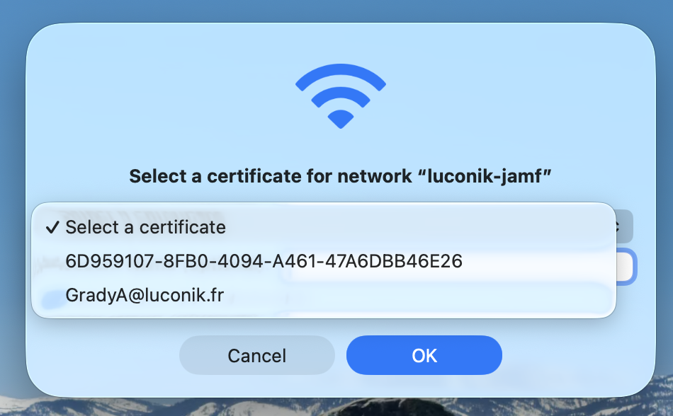

3. Dans Central, ouvrir **Menu > Central NAC > Clients** et sélectionner la période contenant le test.
4. Vérifier que la session est **Accepted**, que le WLAN est `luconik-jamf` et que le rôle correspond au groupe Entra ID.


> Avec le profil Jamf, le champ **User Groups** de la vue Client peut rester vide alors que la policy d’autorisation attribue correctement le rôle. Dans le lab, cela correspond à un défaut d’affichage non bloquant ; valider le résultat sur le rôle effectivement attribué.

## Références

- [Technote HPE — Onboarding with Intune](https://arubanetworking.hpe.com/techdocs/NAC/central-nac/central-nac-uem-onboarding-intune/) — structure et fonctionnement UEM Onboarding Central NAC.
- [Central NAC — Authentication and Authorization](https://arubanetworking.hpe.com/techdocs/NAC/central-nac/central-nac-authorization/).
- [Central NAC — Configuring EAP-TLS Profile](https://arubanetworking.hpe.com/techdocs/new-central/content/nac/config-eap.htm).
- Repo compagnon — configuration détaillée Aruba Central (extension Jamf, NAC) : [`Luconik/hpe-aruba-guides/central-nac-jamf`](https://github.com/Luconik/hpe-aruba-guides/tree/main/central-nac-jamf)

## File structure

> Les captures `01-central-extensions-catalog.png`, `03-central-extension-jamf-config.png`, `04-central-scep-webhook-header.png`, `09-central-nac-authorization-policy.png`, `10-central-nac-eap-tls-profile.png`, `12-nac-client-session-mac.png` et `13-nac-client-session-ipad.png` sont partagées avec le repo compagnon [`central-nac-jamf`](https://github.com/Luconik/hpe-aruba-guides/tree/main/central-nac-jamf) — elles sont dupliquées dans le dossier `screenshots/` de ce repo.

```
jamf-pro/
└── eap-tls/
    ├── README.md              (ce document, FR)
    ├── README-EN.md            (à venir)
    └── screenshots/
        ├── 01-central-extensions-catalog.png     (partagée)
        ├── 03-central-extension-jamf-config.png  (partagée)
        ├── 04-central-scep-webhook-header.png    (partagée)
        ├── 02-jamf-api-role.png
        ├── 04-jamf-api-token-lifetime.png
        ├── 09-central-nac-authorization-policy.png (partagée)
        ├── 10-central-nac-eap-tls-profile.png    (partagée)
        ├── 01-jamf-configuration-profile-general.png
        ├── 03-jamf-certificate-payload.png
        ├── 05-jamf-scep-profile-san.png
        ├── 06-jamf-cert-san-uri.png
        ├── 07-jamf-wifi-profile.png
        ├── 07b-jamf-wifi-trust-identity.png
        ├── 08-jamf-profile-scope.png
        ├── 09-jamf-ios-profile-general.png
        ├── 09b-jamf-ios-wifi-trust.png
        ├── 12-nac-client-session-mac.png         (partagée)
        ├── 13-nac-client-session-ipad.png        (partagée)
        ├── 15-jamf-device-management-profile.png
        ├── 16-jamf-enrollment-general.png
        ├── 17-jamf-enrollment-messaging.png
        ├── 18-jamf-enrollment-computers.png
        ├── 19-jamf-enrollment-devices.png
        ├── 20-jamf-enrollment-access.png
        └── 21-jamf-wifi-cert-picker.png
```
